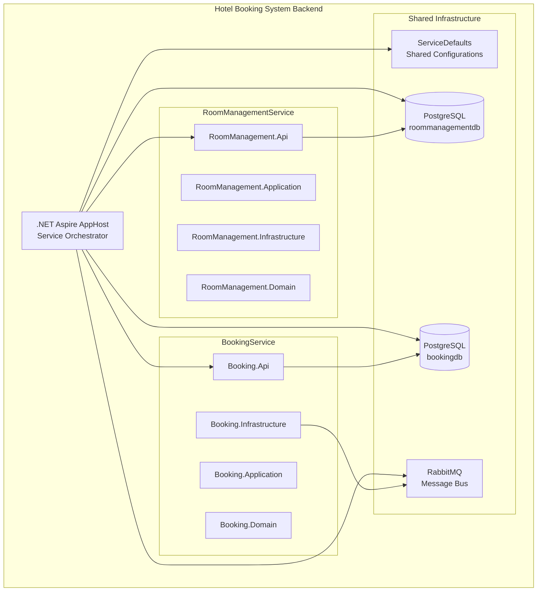
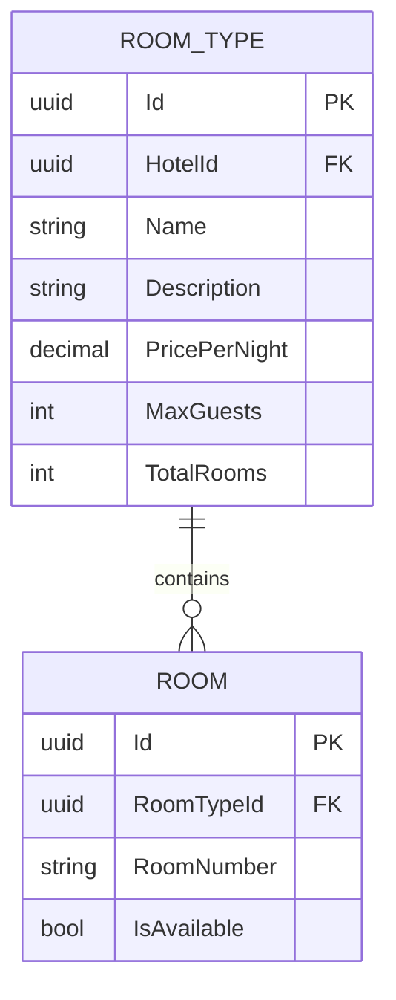
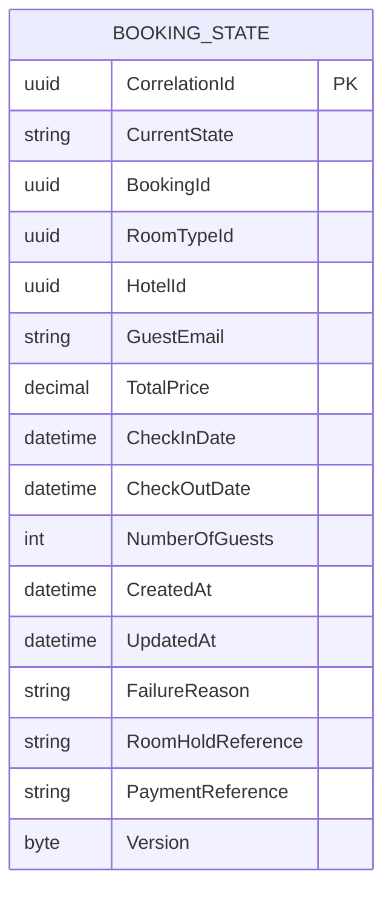

# Backend Architecture Overview: Hotel Booking System

## 1. Overview

The Hotel Booking System backend is built as a microservices architecture using .NET 9 with Clean Architecture principles. The system consists of two primary microservices orchestrated through .NET Aspire, designed to handle room management and booking operations for multiple hotels.

## 2. System Architecture

### 2.1. Microservices Structure



### 2.2. Technology Stack

- **Framework**: .NET 9 / ASP.NET Core
- **Architecture**: Clean Architecture with CQRS pattern
- **Database**: PostgreSQL (separate database per service)
- **ORM**: Entity Framework Core with Code-First approach
- **Messaging**: MassTransit with RabbitMQ (planned)
- **Orchestration**: .NET Aspire
- **API Documentation**: Swagger/OpenAPI
- **Logging**: Serilog with structured logging
- **Health Checks**: Built-in ASP.NET Core health checks
- **Observability**: OpenTelemetry integration
- **Service Discovery**: .NET Aspire service discovery

## 3. Service Details

### 3.1. RoomManagementService

**Purpose**: Manages room types, availability, and hotel inventory

**Current Implementation Status**: ✅ Partially Implemented

**Architecture Layers**:
- **API Layer**: Minimal API endpoints with OpenAPI documentation
- **Application Layer**: CQRS queries with MediatR (commands planned)
- **Infrastructure Layer**: EF Core with PostgreSQL
- **Domain Layer**: Rich domain entities with business logic

**Key Entities**:
- `RoomType`: Core room type entity with hotel association
- `Room`: Individual room instances (planned)

**API Endpoints**:
```
GET /rooms/roomTypes - Get all room types
GET /rooms/roomTypes/{id} - Get specific room type
```

**Database Schema**:


### 3.2. BookingService

**Purpose**: Handles booking lifecycle using Saga pattern for complex workflows

**Current Implementation Status**: 🚧 Infrastructure Setup Complete, Business Logic Planned

**Architecture Layers**:
- **API Layer**: Controllers with Swagger documentation
- **Application Layer**: CQRS with MediatR (planned)
- **Infrastructure Layer**: EF Core, MassTransit configuration
- **Domain Layer**: Saga state entities and enums

**Key Entities**:
- `BookingState`: Saga state machine instance for MassTransit

**Planned Features**:
- Saga-based booking workflow
- Integration with RoomManagementService
- Simulated payment processing
- Real-time status updates via SignalR

**Database Schema** (Planned):


### 3.3. ServiceDefaults

**Purpose**: Shared configurations and cross-cutting concerns

**Features**:
- OpenTelemetry integration (metrics, tracing, logging)
- Health checks configuration
- Service discovery setup
- HTTP client resilience patterns
- Standardized observability

## 4. .NET Aspire Integration

### 4.1. AppHost Configuration

```csharp
var postgres = builder.AddPostgres("postgres").WithDataVolume();
var bookingDb = postgres.AddDatabase("bookingdb");
var roomManagementDb = postgres.AddDatabase("roommanagementdb");

var bookingService = builder.AddProject<Projects.HotelBookingSystem_BookingService_Api>("booking-service")
                           .WithReference(bookingDb);

var roomManagementService = builder.AddProject<Projects.HotelBookingSystem_RoomManagementService_Api>("room-management-service")
                                  .WithReference(roomManagementDb);
```

### 4.2. Service Dependencies

- **Database Per Service**: Each microservice maintains its own PostgreSQL database
- **Message Bus**: RabbitMQ for inter-service communication (planned)
- **Service Discovery**: Automatic service registration and discovery
- **Health Monitoring**: Centralized health check aggregation

## 5. Implementation Patterns

### 5.1. Clean Architecture

Each microservice follows Clean Architecture with clear dependency direction:

```
┌─────────────────┐
│   API Layer     │ ──→ Controllers, Endpoints, Swagger
└─────────────────┘
         │
┌─────────────────┐
│ Application     │ ──→ CQRS, MediatR, DTOs, Validation
│     Layer       │
└─────────────────┘
         │
┌─────────────────┐
│ Infrastructure  │ ──→ EF Core, Repositories, MassTransit
│     Layer       │
└─────────────────┘
         │
┌─────────────────┐
│  Domain Layer   │ ──→ Entities, Value Objects, Domain Events
└─────────────────┘
```

### 5.2. CQRS Pattern

- **Commands**: Write operations (planned for booking creation)
- **Queries**: Read operations (implemented in RoomManagementService)
- **MediatR**: Mediator pattern for request/response handling

### 5.3. Database-First Approach

- **EF Core Migrations**: Code-first database schema management
- **Seeding**: Development data for testing
- **Connection Strings**: Managed through .NET Aspire configuration

## 6. Current Implementation Status

### ✅ Implemented Features

1. **RoomManagementService**:
   - Clean Architecture structure
   - Basic CQRS queries (GetRoomTypes, GetRoomTypeById)
   - EF Core with PostgreSQL
   - Swagger API documentation
   - Multi-hotel support via HotelId

2. **.NET Aspire Orchestration**:
   - Service registration and discovery
   - Database provisioning
   - Health checks and observability
   - Development environment automation

3. **ServiceDefaults**:
   - OpenTelemetry integration
   - Standardized health checks
   - HTTP client resilience

### 🚧 Planned Features

1. **BookingService**:
   - Saga-based booking workflow
   - MassTransit state machine implementation
   - SignalR real-time updates
   - Payment service integration (simulated)

2. **Inter-Service Communication**:
   - RabbitMQ message bus
   - Event-driven architecture
   - Service contracts and schemas

3. **Advanced Patterns**:
   - Result pattern for error handling
   - Domain events
   - Compensation patterns

## 7. Development Environment

### 7.1. Prerequisites

- .NET 9 SDK
- Docker (for PostgreSQL and RabbitMQ)
- .NET Aspire Workload

### 7.2. Getting Started

```bash
# Run the entire system
dotnet run --project src/HotelBookingSystem.AppHost

# Access services
# Room Management API: https://localhost:{port}/swagger
# Booking API: https://localhost:{port}/swagger
# Aspire Dashboard: https://localhost:15888
```

## 8. Next Steps

1. **Complete BookingService Implementation**:
   - Implement booking commands and saga workflow
   - Add MassTransit configuration
   - Integrate with RoomManagementService

2. **Enhance RoomManagementService**:
   - Add room availability management
   - Implement room reservation capabilities
   - Add hotel filtering and search

3. **Add Observability**:
   - Structured logging across services
   - Distributed tracing
   - Performance metrics and monitoring

This architecture provides a solid foundation for a scalable, maintainable hotel booking system with clear separation of concerns and modern .NET development practices. 