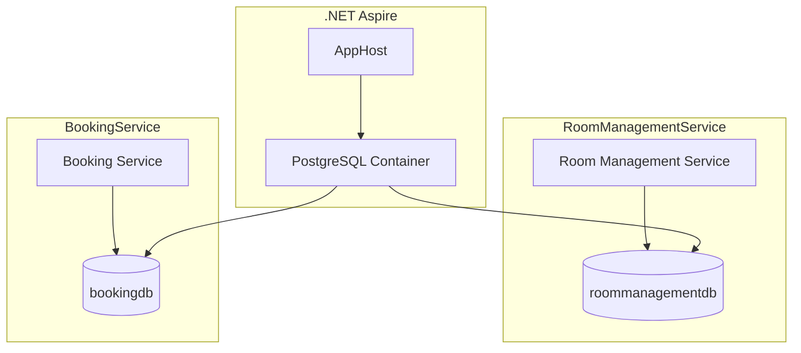
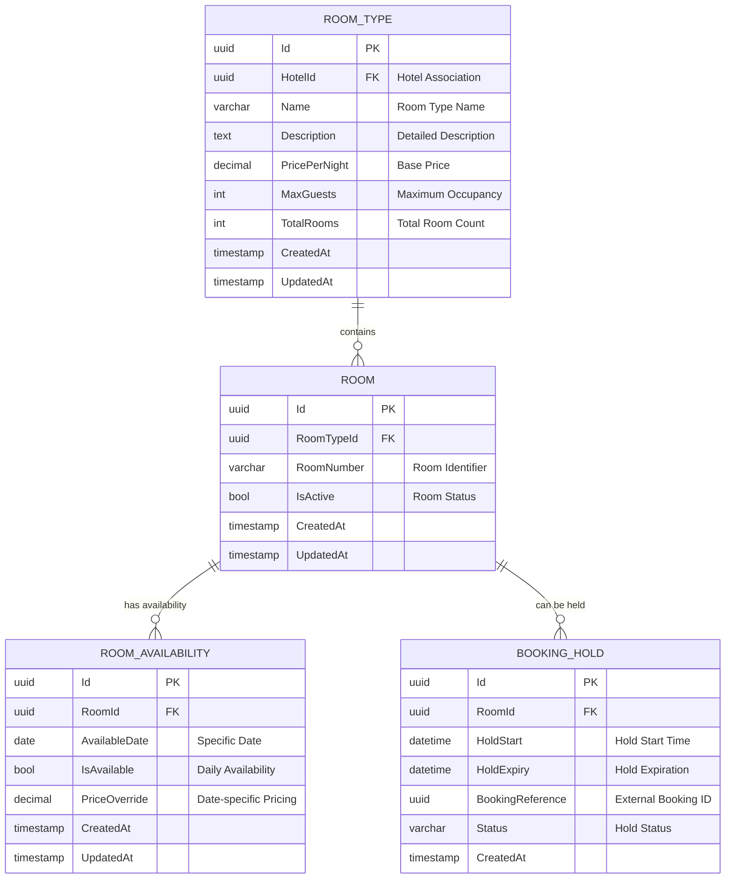
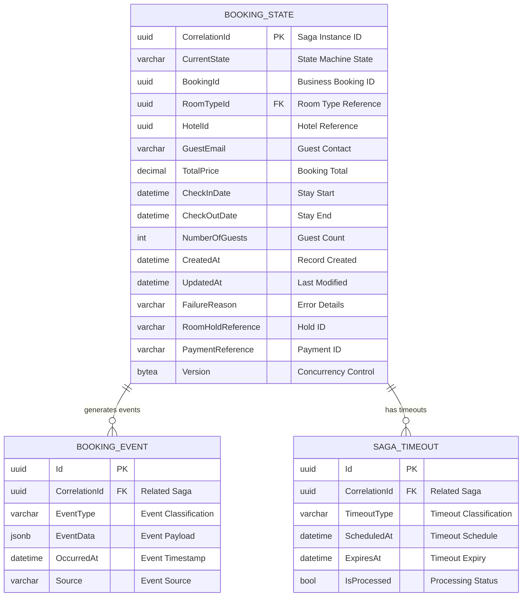
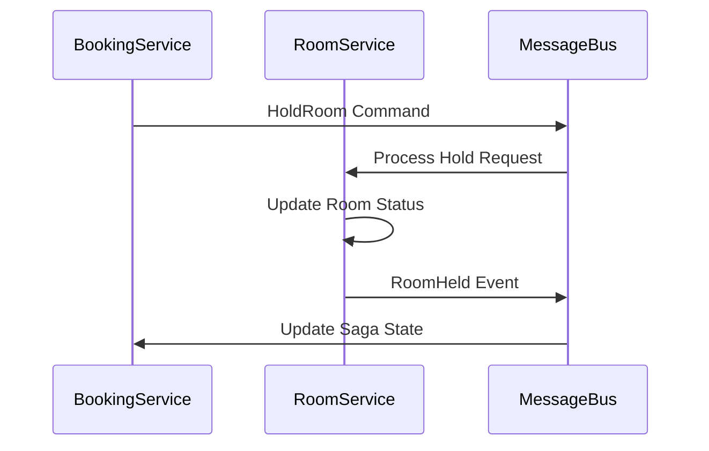
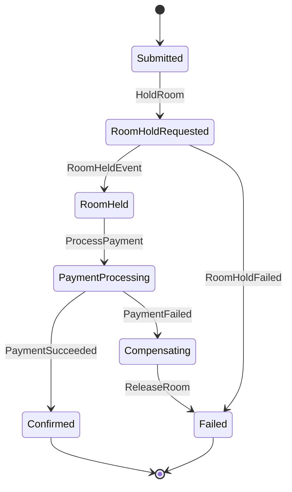

# Backend Database Design: Hotel Booking System

## 1. Overview

The Hotel Booking System employs a database-per-service pattern where each microservice maintains its own PostgreSQL database. This design ensures data isolation, service autonomy, and scalability while supporting the multi-hotel architecture.

## 2. Database Architecture

### 2.1. Database-per-Service Pattern



### 2.2. Technology Stack

- **Database Engine**: PostgreSQL 15+
- **ORM**: Entity Framework Core 8.0
- **Migration Strategy**: Code-First with automatic migrations in development
- **Connection Management**: Connection pooling via .NET Aspire
- **Backup Strategy**: Volume-based persistence for development

## 3. RoomManagementService Database

### 3.1. Database Schema

**Database Name**: `roommanagementdb`



### 3.2. Table Definitions

#### RoomType Table

```sql
CREATE TABLE room_types (
    id UUID PRIMARY KEY DEFAULT gen_random_uuid(),
    hotel_id UUID NOT NULL,
    name VARCHAR(255) NOT NULL,
    description TEXT,
    price_per_night DECIMAL(10,2) NOT NULL CHECK (price_per_night >= 0),
    max_guests INTEGER NOT NULL CHECK (max_guests > 0),
    total_rooms INTEGER NOT NULL CHECK (total_rooms > 0),
    created_at TIMESTAMP WITH TIME ZONE DEFAULT NOW(),
    updated_at TIMESTAMP WITH TIME ZONE DEFAULT NOW(),
    
    CONSTRAINT uk_room_type_hotel_name UNIQUE (hotel_id, name)
);

-- Indexes
CREATE INDEX idx_room_types_hotel_id ON room_types(hotel_id);
CREATE INDEX idx_room_types_price ON room_types(price_per_night);
```

#### Room Table (Planned)

```sql
CREATE TABLE rooms (
    id UUID PRIMARY KEY DEFAULT gen_random_uuid(),
    room_type_id UUID NOT NULL REFERENCES room_types(id) ON DELETE CASCADE,
    room_number VARCHAR(50) NOT NULL,
    is_active BOOLEAN DEFAULT true,
    created_at TIMESTAMP WITH TIME ZONE DEFAULT NOW(),
    updated_at TIMESTAMP WITH TIME ZONE DEFAULT NOW(),
    
    CONSTRAINT uk_room_number_type UNIQUE (room_type_id, room_number)
);

-- Indexes
CREATE INDEX idx_rooms_room_type_id ON rooms(room_type_id);
CREATE INDEX idx_rooms_active ON rooms(is_active) WHERE is_active = true;
```

#### Room Availability Table (Planned)

```sql
CREATE TABLE room_availability (
    id UUID PRIMARY KEY DEFAULT gen_random_uuid(),
    room_id UUID NOT NULL REFERENCES rooms(id) ON DELETE CASCADE,
    available_date DATE NOT NULL,
    is_available BOOLEAN DEFAULT true,
    price_override DECIMAL(10,2),
    created_at TIMESTAMP WITH TIME ZONE DEFAULT NOW(),
    updated_at TIMESTAMP WITH TIME ZONE DEFAULT NOW(),
    
    CONSTRAINT uk_room_date UNIQUE (room_id, available_date)
);

-- Indexes
CREATE INDEX idx_availability_room_date ON room_availability(room_id, available_date);
CREATE INDEX idx_availability_date_range ON room_availability(available_date) WHERE is_available = true;
```

### 3.3. Current Implementation

**Status**: ✅ Partially Implemented

**Implemented Tables**:
- `room_types` - Core room type management
- EF Core DbContext configuration
- Basic seeding for development data

**Entity Configuration**:

```csharp
// RoomType Entity
public class RoomType
{
    public Guid Id { get; private set; }
    public Guid HotelId { get; private set; }
    public string Name { get; private set; }
    public string Description { get; private set; }
    public decimal PricePerNight { get; private set; }
    public int MaxGuests { get; private set; }
    public int TotalRooms { get; private set; }
    
    // Navigation properties
    private readonly List<Room> _rooms = new();
    public IReadOnlyList<Room> Rooms => _rooms.AsReadOnly();
}
```

## 4. BookingService Database

### 4.1. Database Schema

**Database Name**: `bookingdb`



### 4.2. Table Definitions

#### BookingState Table

```sql
CREATE TABLE booking_states (
    correlation_id UUID PRIMARY KEY,
    current_state VARCHAR(50) NOT NULL,
    booking_id UUID NOT NULL,
    room_type_id UUID NOT NULL,
    hotel_id UUID NOT NULL,
    guest_email VARCHAR(255) NOT NULL,
    total_price DECIMAL(10,2) NOT NULL,
    check_in_date DATE NOT NULL,
    check_out_date DATE NOT NULL,
    number_of_guests INTEGER NOT NULL,
    created_at TIMESTAMP WITH TIME ZONE DEFAULT NOW(),
    updated_at TIMESTAMP WITH TIME ZONE DEFAULT NOW(),
    failure_reason TEXT,
    room_hold_reference VARCHAR(255),
    payment_reference VARCHAR(255),
    version BYTEA,
    
    CONSTRAINT ck_check_dates CHECK (check_out_date > check_in_date),
    CONSTRAINT ck_guests CHECK (number_of_guests > 0),
    CONSTRAINT ck_price CHECK (total_price >= 0)
);

-- Indexes
CREATE UNIQUE INDEX idx_booking_states_booking_id ON booking_states(booking_id);
CREATE INDEX idx_booking_states_hotel ON booking_states(hotel_id);
CREATE INDEX idx_booking_states_guest ON booking_states(guest_email);
CREATE INDEX idx_booking_states_dates ON booking_states(check_in_date, check_out_date);
CREATE INDEX idx_booking_states_state ON booking_states(current_state);
```

#### Booking Events Table (Planned)

```sql
CREATE TABLE booking_events (
    id UUID PRIMARY KEY DEFAULT gen_random_uuid(),
    correlation_id UUID NOT NULL REFERENCES booking_states(correlation_id),
    event_type VARCHAR(100) NOT NULL,
    event_data JSONB NOT NULL,
    occurred_at TIMESTAMP WITH TIME ZONE DEFAULT NOW(),
    source VARCHAR(100) NOT NULL
);

-- Indexes
CREATE INDEX idx_booking_events_correlation ON booking_events(correlation_id);
CREATE INDEX idx_booking_events_type ON booking_events(event_type);
CREATE INDEX idx_booking_events_time ON booking_events(occurred_at);
```

#### Saga Timeouts Table (Planned)

```sql
CREATE TABLE saga_timeouts (
    id UUID PRIMARY KEY DEFAULT gen_random_uuid(),
    correlation_id UUID NOT NULL REFERENCES booking_states(correlation_id),
    timeout_type VARCHAR(100) NOT NULL,
    scheduled_at TIMESTAMP WITH TIME ZONE NOT NULL,
    expires_at TIMESTAMP WITH TIME ZONE NOT NULL,
    is_processed BOOLEAN DEFAULT false,
    
    CONSTRAINT ck_timeout_schedule CHECK (expires_at > scheduled_at)
);

-- Indexes
CREATE INDEX idx_saga_timeouts_correlation ON saga_timeouts(correlation_id);
CREATE INDEX idx_saga_timeouts_expiry ON saga_timeouts(expires_at) WHERE is_processed = false;
```

### 4.3. Current Implementation

**Status**: 🚧 Infrastructure Setup Complete

**Implemented Components**:
- `BookingState` entity for MassTransit saga
- EF Core DbContext configuration
- Database migration setup

**Entity Configuration**:

```csharp
// BookingState Entity (Saga Instance)
public class BookingState : SagaStateMachineInstance
{
    public Guid CorrelationId { get; set; }
    public string CurrentState { get; set; }
    public Guid BookingId { get; set; }
    public Guid RoomTypeId { get; set; }
    public Guid HotelId { get; set; }
    public string GuestEmail { get; set; }
    public decimal TotalPrice { get; set; }
    public DateTime CheckInDate { get; set; }
    public DateTime CheckOutDate { get; set; }
    public int NumberOfGuests { get; set; }
    public DateTime CreatedAt { get; set; }
    public DateTime UpdatedAt { get; set; }
    public string? FailureReason { get; set; }
    public string? RoomHoldReference { get; set; }
    public string? PaymentReference { get; set; }
    public byte[] Version { get; set; }
}
```

## 5. Data Consistency Strategy

### 5.1. ACID Properties per Service

Each microservice database maintains ACID properties within its boundary:

- **Atomicity**: Transaction integrity within service
- **Consistency**: Business rules enforced via domain entities
- **Isolation**: Concurrent access handled by EF Core
- **Durability**: PostgreSQL transaction logging

### 5.2. Cross-Service Consistency

**Eventual Consistency**: Achieved through event-driven communication



### 5.3. Compensation Patterns

**Saga Pattern**: Ensures data consistency across services through compensating actions



## 6. Performance Optimization

### 6.1. Indexing Strategy

**RoomManagementService**:
- Hotel-based queries: `idx_room_types_hotel_id`
- Price range searches: `idx_room_types_price`
- Availability lookups: `idx_availability_date_range`

**BookingService**:
- Booking lookups: `idx_booking_states_booking_id`
- Guest history: `idx_booking_states_guest`
- Hotel analytics: `idx_booking_states_hotel`

### 6.2. Query Optimization

**Common Query Patterns**:

```sql
-- Room search by hotel and date range
SELECT rt.*, COUNT(r.id) as available_rooms
FROM room_types rt
LEFT JOIN rooms r ON rt.id = r.room_type_id
LEFT JOIN room_availability ra ON r.id = ra.room_id 
WHERE rt.hotel_id = @hotelId
  AND ra.available_date BETWEEN @checkIn AND @checkOut
  AND ra.is_available = true
GROUP BY rt.id;

-- Booking status lookup
SELECT bs.*, be.event_type, be.occurred_at
FROM booking_states bs
LEFT JOIN booking_events be ON bs.correlation_id = be.correlation_id
WHERE bs.booking_id = @bookingId
ORDER BY be.occurred_at DESC;
```

### 6.3. Connection Pooling

**Configuration**:
```csharp
// Connection string configuration
"ConnectionStrings": {
  "RoomManagementDb": "Host=localhost;Database=roommanagementdb;Username=postgres;Password=***;Pooling=true;MinPoolSize=5;MaxPoolSize=100;ConnectionIdleLifetime=300"
}
```

## 7. Data Migration Strategy

### 7.1. Development Environment

**Automatic Migrations**: Enabled for development convenience

```csharp
// Program.cs - Auto-migration in development
if (app.Environment.IsDevelopment())
{
    using var scope = app.Services.CreateScope();
    var context = scope.ServiceProvider.GetRequiredService<RoomManagementDbContext>();
    await context.Database.MigrateAsync();
}
```

### 7.2. Production Deployment

**Planned Migration Strategy**:
1. **Blue-Green Deployment**: Zero-downtime migrations
2. **Backward Compatibility**: Maintain compatibility during transitions
3. **Rollback Capability**: Migration rollback procedures
4. **Data Validation**: Post-migration data integrity checks

### 7.3. Seeding Strategy

**Development Data**:
```csharp
// Sample room type seeding
protected override void OnModelCreating(ModelBuilder modelBuilder)
{
    modelBuilder.Entity<RoomType>().HasData(
        new RoomType(
            Guid.NewGuid(),
            HotelId: Guid.Parse("11111111-1111-1111-1111-111111111111"),
            "Deluxe Suite",
            "Luxury suite with panoramic city views",
            299.99m,
            4,
            10
        )
    );
}
```

## 8. Backup and Recovery

### 8.1. Development Environment

**Volume Persistence**: 
- Data persists across container restarts
- .NET Aspire manages PostgreSQL volumes
- Local development data preservation

### 8.2. Production Strategy (Planned)

**Backup Strategy**:
- **Point-in-time Recovery**: PostgreSQL WAL archiving
- **Automated Backups**: Daily full backups
- **Cross-Region Replication**: Disaster recovery
- **Backup Testing**: Regular restore validation

## 9. Monitoring and Observability

### 9.1. Database Metrics

**Key Performance Indicators**:
- Connection pool utilization
- Query execution times
- Index usage statistics
- Transaction rollback rates

### 9.2. Health Checks

**Database Health Monitoring**:
```csharp
// Health check configuration
builder.Services.AddHealthChecks()
    .AddDbContextCheck<RoomManagementDbContext>("room_database")
    .AddDbContextCheck<BookingDbContext>("booking_database");
```

## 10. Security Considerations

### 10.1. Access Control

**Database Security**:
- Service-specific database users
- Principle of least privilege
- Connection string encryption
- Network isolation

### 10.2. Data Protection

**Sensitive Data Handling**:
- Guest email hashing (planned)
- Payment data tokenization
- Audit trail for data access
- GDPR compliance considerations

This database design provides a robust foundation for the Hotel Booking System with clear service boundaries, scalability considerations, and modern PostgreSQL features. 