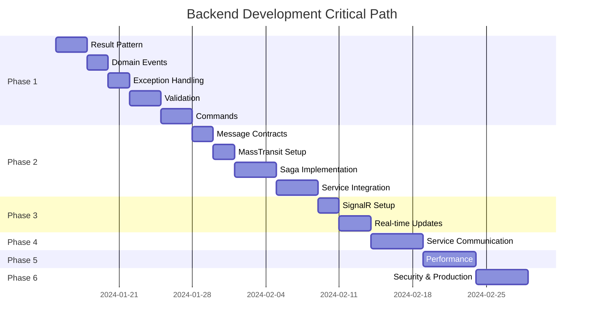

# Backend Development Roadmap: Hotel Booking System

## 1. Overview

This document outlines the development roadmap for the Hotel Booking System backend, focusing on the systematic implementation of features across both microservices. The roadmap is organized into phases, prioritizing foundational elements before advanced features.

## 2. Current Implementation Status

### 2.1. Completed Components ✅

**RoomManagementService**:
- Clean Architecture foundation
- Basic CQRS implementation with MediatR
- PostgreSQL database with EF Core
- Room type domain model with hotel support
- API endpoints for room type queries
- Swagger documentation
- .NET Aspire integration

**Infrastructure & DevOps**:
- .NET Aspire orchestration setup
- ServiceDefaults shared configurations
- PostgreSQL containerization
- Health checks and observability framework
- Serilog structured logging

**BookingService**:
- Clean Architecture structure
- EF Core database context setup
- BookingState saga entity
- Basic MassTransit infrastructure

### 2.2. In Progress 🚧

**RoomManagementService**:
- Room availability management
- Advanced domain logic implementation
- Result pattern integration

**BookingService**:
- Saga state machine implementation
- Message contracts definition

### 2.3. Planned Components 📋

**Core Functionality**:
- Complete booking workflow
- Real-time status updates via SignalR
- Inter-service communication
- Payment service simulation
- Compensation patterns

## 3. Development Phases

### Phase 1: Foundation Enhancement (Weeks 1-2)

**Priority**: 🔴 High - Critical for production readiness

#### RoomManagementService Improvements

**Week 1: Domain & Application Layer**
- [ ] **Task 1.1**: Implement Result pattern for error handling
  - Create `Result<T>` and `Result` base classes
  - Update all entity methods to return results
  - Modify query handlers to use Result pattern
  - Update API endpoints to handle Result responses

- [ ] **Task 1.2**: Implement Domain Events
  - Create `DomainEvent` base class and `BaseEntity`
  - Implement `RoomTypePriceUpdatedEvent`
  - Create domain event dispatcher
  - Add domain event handlers

- [ ] **Task 1.3**: Add Global Exception Handling
  - Create global exception middleware
  - Define custom exception types
  - Implement consistent error response format
  - Add comprehensive logging

**Week 2: Validation & Commands**
- [ ] **Task 1.4**: Implement Input Validation
  - Install and configure FluentValidation
  - Create validators for queries and commands
  - Add validation pipeline behavior for MediatR
  - Implement validation error handling in API

- [ ] **Task 1.5**: Add Room Management Commands
  - Implement `CreateRoomTypeCommand` with handler
  - Add `UpdateRoomTypePricingCommand`
  - Create `DeactivateRoomTypeCommand`
  - Add comprehensive unit tests

#### Database Enhancements
- [ ] **Task 1.6**: Extend database schema
  - Add `Room` entity implementation
  - Create `RoomAvailability` tracking
  - Implement database migrations
  - Add performance indexes

**Deliverables**:
- Production-ready RoomManagementService
- Comprehensive error handling
- Validated command processing
- Extended room management capabilities

---

### Phase 2: Booking Service Implementation (Weeks 3-4)

**Priority**: 🔴 High - Core business functionality

#### Week 3: Saga Foundation

- [ ] **Task 2.1**: Message Contracts Definition
  - Define message interfaces and classes
  - Create booking-related commands (`HoldRoom`, `ProcessPayment`)
  - Implement booking events (`RoomHeld`, `PaymentSucceeded`)
  - Add message serialization and validation

- [ ] **Task 2.2**: MassTransit Configuration
  - Configure RabbitMQ message bus
  - Set up MassTransit with .NET Aspire
  - Implement message routing and topology
  - Add connection resilience patterns

- [ ] **Task 2.3**: Saga State Machine
  - Implement `BookingSagaStateMachine`
  - Define saga states and transitions
  - Add state persistence configuration
  - Implement basic timeout handling

#### Week 4: Service Integration

- [ ] **Task 2.4**: Booking API Implementation
  - Create `CreateBookingCommand` with validation
  - Implement booking controller endpoints
  - Add booking status query handlers
  - Integrate with saga state machine

- [ ] **Task 2.5**: Simulated Services
  - Create `InventoryServiceConsumer` (room hold simulation)
  - Implement `PaymentServiceConsumer` (payment simulation)
  - Add configurable success/failure rates
  - Implement realistic processing delays

- [ ] **Task 2.6**: Compensation Logic
  - Implement rollback mechanisms
  - Add `ReleaseRoomConsumer` for compensation
  - Create failure scenario handling
  - Add comprehensive saga testing

**Deliverables**:
- Functional booking workflow
- Saga pattern implementation
- Simulated external services
- Compensation handling

---

### Phase 3: Real-time Communication (Week 5)

**Priority**: 🟡 Medium - Enhanced user experience

#### SignalR Integration

- [ ] **Task 3.1**: SignalR Hub Setup
  - Create `BookingStatusHub`
  - Implement client connection management
  - Add booking group management
  - Configure SignalR with .NET Aspire

- [ ] **Task 3.2**: Real-time Status Updates
  - Integrate SignalR with saga state machine
  - Push status updates during state transitions
  - Implement connection handling for disconnects
  - Add message delivery guarantees

- [ ] **Task 3.3**: Client Integration Support
  - Create TypeScript client definitions
  - Add connection examples and documentation
  - Implement reconnection logic
  - Add error handling patterns

**Deliverables**:
- Real-time booking status updates
- SignalR hub implementation
- Client integration support

---

### Phase 4: Service Communication Enhancement (Week 6)

**Priority**: 🟡 Medium - Inter-service coordination

#### Cross-Service Integration

- [ ] **Task 4.1**: Room Availability Integration
  - Create room availability check endpoint
  - Implement availability service client in BookingService
  - Add circuit breaker patterns
  - Integrate availability check into booking saga

- [ ] **Task 4.2**: Event-Driven Communication
  - Implement domain events across services
  - Add event publishing infrastructure
  - Create event handlers for business processes
  - Implement event store (optional)

- [ ] **Task 4.3**: Service Discovery & Resilience
  - Enhance .NET Aspire service discovery
  - Add retry policies for service calls
  - Implement timeout and fallback strategies
  - Add service health monitoring

**Deliverables**:
- Integrated room availability checking
- Event-driven architecture
- Service resilience patterns

---

### Phase 5: Performance & Observability (Week 7)

**Priority**: 🟢 Low - Optimization and monitoring

#### Performance Optimization

- [ ] **Task 5.1**: Caching Implementation
  - Add Redis caching layer
  - Implement cache-aside pattern for room types
  - Add cache invalidation strategies
  - Monitor cache hit/miss ratios

- [ ] **Task 5.2**: Database Optimization
  - Add database query performance monitoring
  - Implement read-side optimizations
  - Add database connection pooling tuning
  - Create performance benchmarks

#### Observability Enhancement

- [ ] **Task 5.3**: Advanced Logging
  - Implement structured logging with correlation IDs
  - Add performance logging for operations
  - Create log aggregation and analysis
  - Add security audit logging

- [ ] **Task 5.4**: Metrics & Monitoring
  - Implement custom application metrics
  - Add business metric tracking (bookings, revenue)
  - Create monitoring dashboards
  - Set up alerting rules

**Deliverables**:
- Performance-optimized services
- Comprehensive observability
- Monitoring and alerting

---

### Phase 6: Security & Production Readiness (Week 8)

**Priority**: 🟡 Medium - Production deployment preparation

#### Security Implementation

- [ ] **Task 6.1**: Authentication & Authorization
  - Implement JWT authentication support
  - Add role-based authorization
  - Create API key management
  - Add rate limiting

- [ ] **Task 6.2**: Data Protection
  - Implement data encryption at rest
  - Add PII data handling
  - Create data retention policies
  - Implement GDPR compliance features

#### Production Readiness

- [ ] **Task 6.3**: Configuration Management
  - Externalize configuration settings
  - Add environment-specific configurations
  - Implement secrets management
  - Create configuration validation

- [ ] **Task 6.4**: Testing & Quality Assurance
  - Complete unit test coverage
  - Add integration tests
  - Create load testing scenarios
  - Implement automated quality gates

**Deliverables**:
- Production-ready security
- Comprehensive testing
- Configuration management

## 4. Implementation Dependencies

### 4.1. Critical Path Dependencies

### 4.2. Parallel Development Opportunities

**Can be developed in parallel**:
- SignalR implementation (Phase 3) can start after basic saga is working
- Performance optimizations can be ongoing throughout
- Testing can be implemented alongside feature development

**Blocking Dependencies**:
- Message contracts must be defined before saga implementation
- Basic booking workflow must work before real-time updates
- Result pattern should be implemented before complex error scenarios

## 5. Quality Gates

### 5.1. Phase Completion Criteria

**Phase 1 - Foundation Enhancement**:
- [ ] All existing tests pass
- [ ] Result pattern implemented in all operations
- [ ] Domain events working correctly
- [ ] Validation prevents invalid operations
- [ ] Exception handling provides clear error messages

**Phase 2 - Booking Service**:
- [ ] Booking saga completes successfully
- [ ] Compensation logic works for all failure scenarios
- [ ] Message contracts are versioned and documented
- [ ] Performance meets requirements (< 30 seconds for booking)

**Phase 3 - Real-time Communication**:
- [ ] SignalR delivers messages reliably
- [ ] Connection handling is robust
- [ ] Integration examples work correctly

**Phase 4 - Service Communication**:
- [ ] Services can communicate reliably
- [ ] Circuit breakers prevent cascade failures
- [ ] Service discovery works automatically

**Phase 5 - Performance & Observability**:
- [ ] Performance targets met (95th percentile < 200ms)
- [ ] Observability provides actionable insights
- [ ] No memory leaks or resource issues

**Phase 6 - Security & Production**:
- [ ] Security scan passes
- [ ] Load testing meets requirements
- [ ] Production deployment succeeds

### 5.2. Testing Strategy

**Unit Testing**:
- Domain logic testing
- Command/query handler testing
- Saga state machine testing
- Message contract testing

**Integration Testing**:
- Database integration testing
- Service-to-service communication testing
- SignalR hub testing
- End-to-end workflow testing

**Performance Testing**:
- Load testing for booking workflows
- Stress testing for concurrent users
- Database performance testing
- Memory and resource usage testing

## 6. Risk Management

### 6.1. Technical Risks

| Risk | Impact | Probability | Mitigation |
|------|--------|-------------|------------|
| MassTransit complexity | High | Medium | Start with simple scenarios, build complexity gradually |
| SignalR connection issues | Medium | Medium | Implement robust reconnection logic, fallback to polling |
| Database performance | High | Low | Monitor early, optimize queries, add indexes proactively |
| Service communication failures | High | Medium | Implement circuit breakers, timeouts, and retries |
| .NET Aspire limitations | Medium | Low | Have containerization fallback plan |

### 6.2. Schedule Risks

| Risk | Impact | Probability | Mitigation |
|------|--------|-------------|------------|
| Phase 2 complexity underestimated | High | Medium | Add buffer time, start simple and iterate |
| Third-party dependency issues | Medium | Low | Identify alternatives, implement abstractions |
| Integration complexity | Medium | Medium | Plan integration points early, test frequently |

## 7. Success Metrics

### 7.1. Technical Metrics

- **Code Quality**: > 80% test coverage, zero critical security vulnerabilities
- **Performance**: 95th percentile response time < 200ms
- **Reliability**: > 99.9% uptime, < 0.1% error rate
- **Scalability**: Handle 1000 concurrent booking requests

### 7.2. Business Metrics

- **Booking Success Rate**: > 95% successful bookings
- **Time to Complete**: < 30 seconds average booking time
- **User Experience**: Real-time status updates < 1 second latency

### 7.3. Development Metrics

- **Velocity**: Complete phases on schedule
- **Quality**: < 5% bug discovery rate post-phase
- **Maintainability**: Clear architecture, documented APIs

## 8. Next Steps

### 8.1. Immediate Actions (Next Week)

1. **Set up development environment** with latest .NET Aspire
2. **Create development branch** for Phase 1 implementation
3. **Begin Result pattern implementation** in RoomManagementService
4. **Set up project tracking** for task management

### 8.2. Preparation for Phase 2

1. **Research MassTransit best practices** for saga implementation
2. **Design message contracts** and service boundaries
3. **Plan RabbitMQ infrastructure** setup
4. **Prepare testing strategies** for distributed systems

This roadmap provides a clear path from the current implementation state to a production-ready Hotel Booking System backend, with well-defined phases, dependencies, and success criteria. 