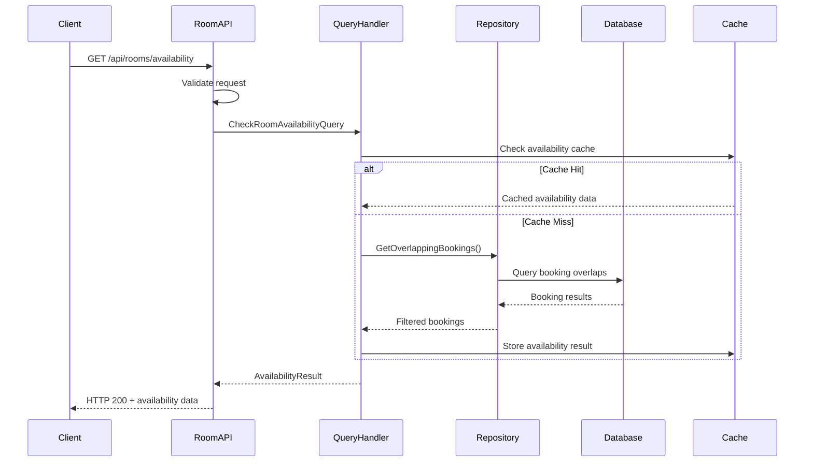
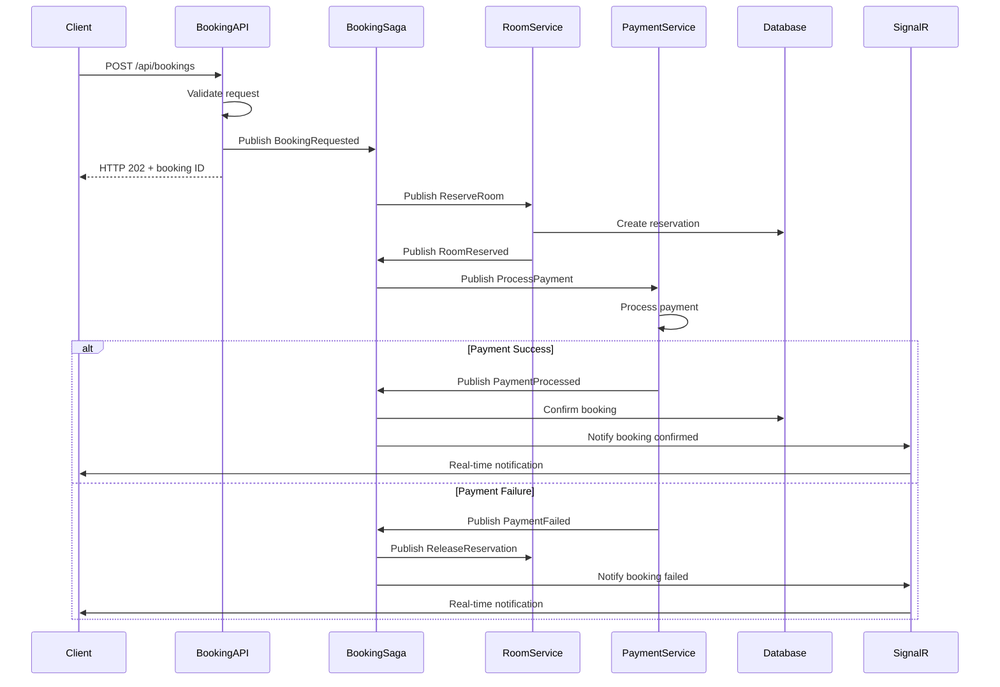

# Backend Technical Design Document

## Executive Summary

This Technical Design Document provides detailed technical specifications for the Hotel Booking System's microservices architecture. It defines component interactions, data flows, algorithms, communication patterns, and implementation strategies for the RoomManagementService and BookingService components.

## Table of Contents

1. [System Architecture](#system-architecture)
2. [Component Design](#component-design)
3. [Data Flow Specifications](#data-flow-specifications)
4. [Service Communication](#service-communication)
5. [Algorithm Specifications](#algorithm-specifications)
6. [Error Handling Strategy](#error-handling-strategy)
7. [Security Implementation](#security-implementation)
8. [Performance Design](#performance-design)
9. [Integration Patterns](#integration-patterns)
10. [Deployment Architecture](#deployment-architecture)

## System Architecture

### High-Level Component Design

```mermaid
C4Component
    title Component Diagram - Hotel Booking System

    Container_Boundary(aspire, ".NET Aspire Host") {
        Component(apphost, "App Host", "Orchestration", "Service discovery, configuration, monitoring")
    }
    
    Container_Boundary(room_service, "Room Management Service") {
        Component(room_api, "Room API", "Minimal API", "HTTP endpoints for room operations")
        Component(room_app, "Application Layer", "CQRS/MediatR", "Command/Query handlers, business logic")
        Component(room_domain, "Domain Layer", "Domain Entities", "Room, RoomType business logic")
        Component(room_infra, "Infrastructure", "EF Core/PostgreSQL", "Data persistence, external integrations")
    }
    
    Container_Boundary(booking_service, "Booking Service") {
        Component(booking_api, "Booking API", "Minimal API", "HTTP endpoints for booking operations")
        Component(booking_saga, "Booking Saga", "MassTransit", "Orchestrates booking workflow")
        Component(booking_domain, "Domain Layer", "Domain Entities", "Booking business logic")
        Component(booking_infra, "Infrastructure", "EF Core/PostgreSQL", "Data persistence, message handling")
    }
    
    Container_Boundary(messaging, "Message Infrastructure") {
        Component(masstransit, "MassTransit", "Service Bus", "Async message routing and delivery")
        Component(signalr, "SignalR Hub", "Real-time", "Live booking notifications")
    }
    
    Container_Boundary(data, "Data Layer") {
        Component(room_db, "Room Database", "PostgreSQL", "Room and hotel data")
        Component(booking_db, "Booking Database", "PostgreSQL", "Booking and saga state data")
    }

    Rel(room_api, room_app, "Uses")
    Rel(room_app, room_domain, "Uses")
    Rel(room_app, room_infra, "Uses")
    Rel(room_infra, room_db, "Reads/Writes")
    
    Rel(booking_api, booking_saga, "Triggers")
    Rel(booking_saga, booking_domain, "Uses")
    Rel(booking_saga, booking_infra, "Uses")
    Rel(booking_infra, booking_db, "Reads/Writes")
    
    Rel(booking_saga, masstransit, "Publishes/Consumes")
    Rel(room_app, masstransit, "Publishes/Consumes")
    Rel(booking_saga, signalr, "Notifies")
    
    Rel(apphost, room_service, "Orchestrates")
    Rel(apphost, booking_service, "Orchestrates")
```

### Layer Responsibilities

**API Layer**
- HTTP endpoint exposure via Minimal APIs
- Request/response serialization
- Authentication/authorization validation
- Rate limiting and throttling
- API versioning support

**Application Layer**
- CQRS command/query handling via MediatR
- Business workflow orchestration
- Cross-cutting concerns (logging, validation)
- Domain event publishing
- Result pattern implementation

**Domain Layer**
- Core business entities and value objects
- Domain services and specifications
- Business rule enforcement
- Domain event definitions
- Aggregate root management

**Infrastructure Layer**
- Data persistence via Entity Framework Core
- External service integration
- Message bus implementation
- Configuration management
- Cross-cutting infrastructure concerns

## Component Design

### RoomManagementService Components

#### Room Domain Entity

```csharp
public class Room : Entity<Guid>, IAggregateRoot
{
    public Guid HotelId { get; private set; }
    public Guid RoomTypeId { get; private set; }
    public string RoomNumber { get; private set; }
    public bool IsActive { get; private set; }
    public DateTime CreatedAt { get; private set; }
    public DateTime? UpdatedAt { get; private set; }

    // Navigation properties
    public RoomType RoomType { get; private set; }
    
    private Room() { } // EF Core constructor
    
    private Room(Guid hotelId, Guid roomTypeId, string roomNumber)
    {
        Id = Guid.NewGuid();
        HotelId = hotelId;
        RoomTypeId = roomTypeId;
        RoomNumber = roomNumber;
        IsActive = true;
        CreatedAt = DateTime.UtcNow;
        
        // Domain event
        AddDomainEvent(new RoomCreatedEvent(Id, HotelId, RoomTypeId, RoomNumber));
    }
    
    public static Room Create(Guid hotelId, Guid roomTypeId, string roomNumber)
    {
        // Business rule validation
        if (string.IsNullOrWhiteSpace(roomNumber))
            throw new ArgumentException("Room number cannot be empty", nameof(roomNumber));
            
        return new Room(hotelId, roomTypeId, roomNumber);
    }
    
    public void UpdateRoomNumber(string newRoomNumber)
    {
        if (string.IsNullOrWhiteSpace(newRoomNumber))
            throw new ArgumentException("Room number cannot be empty", nameof(newRoomNumber));
            
        var oldRoomNumber = RoomNumber;
        RoomNumber = newRoomNumber;
        UpdatedAt = DateTime.UtcNow;
        
        AddDomainEvent(new RoomNumberChangedEvent(Id, oldRoomNumber, newRoomNumber));
    }
    
    public void Activate()
    {
        if (IsActive) return;
        
        IsActive = true;
        UpdatedAt = DateTime.UtcNow;
        AddDomainEvent(new RoomActivatedEvent(Id));
    }
    
    public void Deactivate()
    {
        if (!IsActive) return;
        
        IsActive = false;
        UpdatedAt = DateTime.UtcNow;
        AddDomainEvent(new RoomDeactivatedEvent(Id));
    }
}
```

#### Room Query Handler

```csharp
public class GetRoomsByHotelQueryHandler : IRequestHandler<GetRoomsByHotelQuery, Result<List<RoomDto>>>
{
    private readonly IRoomRepository _roomRepository;
    private readonly IMapper _mapper;
    private readonly ILogger<GetRoomsByHotelQueryHandler> _logger;
    
    public GetRoomsByHotelQueryHandler(
        IRoomRepository roomRepository,
        IMapper mapper,
        ILogger<GetRoomsByHotelQueryHandler> logger)
    {
        _roomRepository = roomRepository;
        _mapper = mapper;
        _logger = logger;
    }
    
    public async Task<Result<List<RoomDto>>> Handle(
        GetRoomsByHotelQuery request,
        CancellationToken cancellationToken)
    {
        try
        {
            _logger.LogInformation("Retrieving rooms for hotel {HotelId}", request.HotelId);
            
            var rooms = await _roomRepository.GetByHotelIdAsync(request.HotelId, cancellationToken);
            var roomDtos = _mapper.Map<List<RoomDto>>(rooms);
            
            _logger.LogInformation("Retrieved {Count} rooms for hotel {HotelId}", 
                roomDtos.Count, request.HotelId);
                
            return Result<List<RoomDto>>.Success(roomDtos);
        }
        catch (Exception ex)
        {
            _logger.LogError(ex, "Error retrieving rooms for hotel {HotelId}", request.HotelId);
            return Result<List<RoomDto>>.Failure($"Failed to retrieve rooms: {ex.Message}");
        }
    }
}
```

### BookingService Components

#### Booking Saga State Machine

```csharp
public class BookingStateSaga : SagaStateMachineInstance
{
    public Guid CorrelationId { get; set; }
    public string CurrentState { get; set; }
    
    // Booking details
    public Guid BookingId { get; set; }
    public Guid HotelId { get; set; }
    public Guid RoomId { get; set; }
    public DateTime CheckInDate { get; set; }
    public DateTime CheckOutDate { get; set; }
    public string GuestEmail { get; set; }
    public decimal TotalAmount { get; set; }
    
    // Workflow tracking
    public DateTime? ReservationExpiry { get; set; }
    public string PaymentIntentId { get; set; }
    public int RetryCount { get; set; }
    public string FailureReason { get; set; }
}

public class BookingStateMachine : MassTransitStateMachine<BookingStateSaga>
{
    public State Initial { get; private set; }
    public State Reserving { get; private set; }
    public State Reserved { get; private set; }
    public State ProcessingPayment { get; private set; }
    public State PaymentCompleted { get; private set; }
    public State Confirmed { get; private set; }
    public State Failed { get; private set; }
    public State Cancelled { get; private set; }
    
    // Events
    public Event<BookingRequested> BookingRequested { get; private set; }
    public Event<RoomReserved> RoomReserved { get; private set; }
    public Event<RoomReservationFailed> RoomReservationFailed { get; private set; }
    public Event<PaymentProcessed> PaymentProcessed { get; private set; }
    public Event<PaymentFailed> PaymentFailed { get; private set; }
    public Event<BookingCancellationRequested> BookingCancellationRequested { get; private set; }
    
    // Schedules
    public Schedule<BookingStateSaga, ReservationExpired> ReservationExpiry { get; private set; }
    
    public BookingStateMachine()
    {
        InstanceState(x => x.CurrentState);
        
        Event(() => BookingRequested, x => x.CorrelateById(m => m.Message.BookingId));
        Event(() => RoomReserved, x => x.CorrelateById(m => m.Message.BookingId));
        Event(() => RoomReservationFailed, x => x.CorrelateById(m => m.Message.BookingId));
        Event(() => PaymentProcessed, x => x.CorrelateById(m => m.Message.BookingId));
        Event(() => PaymentFailed, x => x.CorrelateById(m => m.Message.BookingId));
        Event(() => BookingCancellationRequested, x => x.CorrelateById(m => m.Message.BookingId));
        
        Schedule(() => ReservationExpiry, x => x.ReservationExpiry, s =>
        {
            s.Delay = TimeSpan.FromMinutes(15); // 15-minute reservation window
            s.Received = x => x.CorrelateById(m => m.Message.BookingId);
        });
        
        Initially(
            When(BookingRequested)
                .Then(context =>
                {
                    context.Saga.BookingId = context.Message.BookingId;
                    context.Saga.HotelId = context.Message.HotelId;
                    context.Saga.RoomId = context.Message.RoomId;
                    context.Saga.CheckInDate = context.Message.CheckInDate;
                    context.Saga.CheckOutDate = context.Message.CheckOutDate;
                    context.Saga.GuestEmail = context.Message.GuestEmail;
                    context.Saga.TotalAmount = context.Message.TotalAmount;
                })
                .Publish(context => new ReserveRoom
                {
                    BookingId = context.Saga.BookingId,
                    HotelId = context.Saga.HotelId,
                    RoomId = context.Saga.RoomId,
                    CheckInDate = context.Saga.CheckInDate,
                    CheckOutDate = context.Saga.CheckOutDate,
                    ReservationExpiry = DateTime.UtcNow.AddMinutes(15)
                })
                .Schedule(ReservationExpiry, context => new ReservationExpired
                {
                    BookingId = context.Saga.BookingId
                })
                .TransitionTo(Reserving)
        );
        
        During(Reserving,
            When(RoomReserved)
                .Unschedule(ReservationExpiry)
                .Publish(context => new ProcessPayment
                {
                    BookingId = context.Saga.BookingId,
                    Amount = context.Saga.TotalAmount,
                    GuestEmail = context.Saga.GuestEmail
                })
                .TransitionTo(ProcessingPayment),
                
            When(RoomReservationFailed)
                .Unschedule(ReservationExpiry)
                .Then(context => context.Saga.FailureReason = context.Message.Reason)
                .Publish(context => new BookingFailed
                {
                    BookingId = context.Saga.BookingId,
                    Reason = context.Message.Reason
                })
                .TransitionTo(Failed),
                
            When(ReservationExpiry.Received)
                .Then(context => context.Saga.FailureReason = "Reservation expired")
                .Publish(context => new BookingFailed
                {
                    BookingId = context.Saga.BookingId,
                    Reason = "Reservation expired"
                })
                .TransitionTo(Failed)
        );
        
        During(ProcessingPayment,
            When(PaymentProcessed)
                .Then(context => context.Saga.PaymentIntentId = context.Message.PaymentIntentId)
                .Publish(context => new ConfirmBooking
                {
                    BookingId = context.Saga.BookingId,
                    PaymentIntentId = context.Message.PaymentIntentId
                })
                .TransitionTo(Confirmed),
                
            When(PaymentFailed)
                .Then(context => context.Saga.FailureReason = context.Message.Reason)
                .Publish(context => new ReleaseReservation
                {
                    BookingId = context.Saga.BookingId,
                    RoomId = context.Saga.RoomId
                })
                .Publish(context => new BookingFailed
                {
                    BookingId = context.Saga.BookingId,
                    Reason = context.Message.Reason
                })
                .TransitionTo(Failed)
        );
        
        DuringAny(
            When(BookingCancellationRequested)
                .If(context => context.Saga.CurrentState == Confirmed.Name)
                .Publish(context => new ProcessRefund
                {
                    BookingId = context.Saga.BookingId,
                    PaymentIntentId = context.Saga.PaymentIntentId,
                    Amount = context.Saga.TotalAmount
                })
                .Publish(context => new ReleaseReservation
                {
                    BookingId = context.Saga.BookingId,
                    RoomId = context.Saga.RoomId
                })
                .TransitionTo(Cancelled)
        );
    }
}
```

## Data Flow Specifications

### Room Availability Query Flow



### Booking Creation Workflow



## Service Communication

### Message Contracts

```csharp
// Booking workflow messages
public record BookingRequested
{
    public Guid BookingId { get; init; }
    public Guid HotelId { get; init; }
    public Guid RoomId { get; init; }
    public DateTime CheckInDate { get; init; }
    public DateTime CheckOutDate { get; init; }
    public string GuestEmail { get; init; }
    public decimal TotalAmount { get; init; }
}

public record ReserveRoom
{
    public Guid BookingId { get; init; }
    public Guid HotelId { get; init; }
    public Guid RoomId { get; init; }
    public DateTime CheckInDate { get; init; }
    public DateTime CheckOutDate { get; init; }
    public DateTime ReservationExpiry { get; init; }
}

public record RoomReserved
{
    public Guid BookingId { get; init; }
    public Guid ReservationId { get; init; }
    public DateTime ExpiresAt { get; init; }
}

public record ProcessPayment
{
    public Guid BookingId { get; init; }
    public decimal Amount { get; init; }
    public string GuestEmail { get; init; }
    public string Currency { get; init; } = "USD";
}
```

### Service Discovery Configuration

```csharp
// Program.cs - Service registration
var builder = WebApplication.CreateBuilder(args);

builder.AddServiceDefaults();

// RoomManagementService registration
builder.Services.AddScoped<IRoomRepository, RoomRepository>();
builder.Services.AddMediatR(typeof(GetRoomsByHotelQueryHandler));

// MassTransit configuration
builder.Services.AddMassTransit(x =>
{
    x.AddEntityFrameworkOutbox<RoomManagementDbContext>(o =>
    {
        o.QueryDelay = TimeSpan.FromSeconds(1);
        o.UsePostgres();
        o.UseBusOutbox();
    });
    
    x.AddConsumer<ReserveRoomConsumer>();
    
    x.UsingInMemory((context, cfg) =>
    {
        cfg.ConfigureEndpoints(context);
    });
});

// Database configuration
builder.AddNpgsqlDbContext<RoomManagementDbContext>("room-management-db");
```

## Algorithm Specifications

### Room Availability Algorithm

```csharp
public class RoomAvailabilityService : IRoomAvailabilityService
{
    private readonly IRoomRepository _roomRepository;
    private readonly IBookingRepository _bookingRepository;
    private readonly IMemoryCache _cache;
    
    public async Task<Result<List<AvailableRoom>>> CheckAvailabilityAsync(
        Guid hotelId,
        DateTime checkIn,
        DateTime checkOut,
        int guestCount,
        CancellationToken cancellationToken = default)
    {
        // Input validation
        if (checkIn >= checkOut)
            return Result<List<AvailableRoom>>.Failure("Check-in date must be before check-out date");
            
        if (checkIn < DateTime.Today)
            return Result<List<AvailableRoom>>.Failure("Check-in date cannot be in the past");
            
        if (guestCount <= 0)
            return Result<List<AvailableRoom>>.Failure("Guest count must be positive");
        
        // Cache key generation
        var cacheKey = $"availability:{hotelId}:{checkIn:yyyy-MM-dd}:{checkOut:yyyy-MM-dd}:{guestCount}";
        
        // Try cache first
        if (_cache.TryGetValue(cacheKey, out List<AvailableRoom> cachedResult))
        {
            return Result<List<AvailableRoom>>.Success(cachedResult);
        }
        
        try
        {
            // Step 1: Get all active rooms for the hotel that meet capacity requirements
            var candidateRooms = await _roomRepository.GetAvailableRoomsAsync(
                hotelId, guestCount, cancellationToken);
            
            if (!candidateRooms.Any())
            {
                return Result<List<AvailableRoom>>.Success(new List<AvailableRoom>());
            }
            
            // Step 2: Get all confirmed bookings that overlap with the requested period
            var overlappingBookings = await _bookingRepository.GetOverlappingBookingsAsync(
                candidateRooms.Select(r => r.Id).ToList(),
                checkIn,
                checkOut,
                cancellationToken);
            
            // Step 3: Filter out rooms with overlapping bookings
            var bookedRoomIds = overlappingBookings
                .Where(b => b.Status == BookingStatus.Confirmed || b.Status == BookingStatus.CheckedIn)
                .Select(b => b.RoomId)
                .ToHashSet();
            
            var availableRooms = candidateRooms
                .Where(room => !bookedRoomIds.Contains(room.Id))
                .Select(room => new AvailableRoom
                {
                    RoomId = room.Id,
                    RoomNumber = room.RoomNumber,
                    RoomType = room.RoomType.Name,
                    Capacity = room.RoomType.Capacity,
                    PricePerNight = room.RoomType.PricePerNight,
                    TotalPrice = CalculateTotalPrice(room.RoomType.PricePerNight, checkIn, checkOut)
                })
                .OrderBy(r => r.PricePerNight)
                .ToList();
            
            // Cache the result for 5 minutes
            _cache.Set(cacheKey, availableRooms, TimeSpan.FromMinutes(5));
            
            return Result<List<AvailableRoom>>.Success(availableRooms);
        }
        catch (Exception ex)
        {
            return Result<List<AvailableRoom>>.Failure($"Error checking availability: {ex.Message}");
        }
    }
    
    private decimal CalculateTotalPrice(decimal pricePerNight, DateTime checkIn, DateTime checkOut)
    {
        var nights = (checkOut - checkIn).Days;
        return pricePerNight * nights;
    }
}
```

### Dynamic Pricing Algorithm

```csharp
public class DynamicPricingService : IDynamicPricingService
{
    private readonly IRoomRepository _roomRepository;
    private readonly IBookingRepository _bookingRepository;
    private readonly IConfiguration _configuration;
    
    public async Task<decimal> CalculateRoomPriceAsync(
        Guid roomTypeId,
        DateTime checkIn,
        DateTime checkOut,
        CancellationToken cancellationToken = default)
    {
        var roomType = await _roomRepository.GetRoomTypeAsync(roomTypeId, cancellationToken);
        var basePrice = roomType.PricePerNight;
        
        // Occupancy-based pricing
        var occupancyRate = await CalculateOccupancyRateAsync(roomType.HotelId, checkIn, checkOut, cancellationToken);
        var occupancyMultiplier = CalculateOccupancyMultiplier(occupancyRate);
        
        // Seasonal pricing
        var seasonalMultiplier = CalculateSeasonalMultiplier(checkIn);
        
        // Advance booking discount
        var advanceBookingMultiplier = CalculateAdvanceBookingMultiplier(checkIn);
        
        // Length of stay discount
        var lengthOfStayMultiplier = CalculateLengthOfStayMultiplier(checkIn, checkOut);
        
        var finalPrice = basePrice * 
                        occupancyMultiplier * 
                        seasonalMultiplier * 
                        advanceBookingMultiplier * 
                        lengthOfStayMultiplier;
        
        return Math.Round(finalPrice, 2);
    }
    
    private decimal CalculateOccupancyMultiplier(double occupancyRate)
    {
        return occupancyRate switch
        {
            >= 0.9 => 1.5m,  // High demand - 50% increase
            >= 0.8 => 1.3m,  // High demand - 30% increase
            >= 0.6 => 1.1m,  // Medium demand - 10% increase
            >= 0.4 => 1.0m,  // Normal pricing
            _ => 0.8m         // Low demand - 20% discount
        };
    }
    
    private decimal CalculateSeasonalMultiplier(DateTime checkIn)
    {
        var month = checkIn.Month;
        return month switch
        {
            12 or 1 or 2 => 1.4m,   // Winter holidays - 40% increase
            6 or 7 or 8 => 1.3m,    // Summer peak - 30% increase
            3 or 4 or 5 => 1.1m,    // Spring - 10% increase
            9 or 10 or 11 => 1.0m   // Fall - normal pricing
        };
    }
}
```

## Error Handling Strategy

### Global Exception Handling

```csharp
public class GlobalExceptionHandlingMiddleware
{
    private readonly RequestDelegate _next;
    private readonly ILogger<GlobalExceptionHandlingMiddleware> _logger;
    
    public GlobalExceptionHandlingMiddleware(RequestDelegate next, ILogger<GlobalExceptionHandlingMiddleware> logger)
    {
        _next = next;
        _logger = logger;
    }
    
    public async Task InvokeAsync(HttpContext context)
    {
        try
        {
            await _next(context);
        }
        catch (Exception ex)
        {
            _logger.LogError(ex, "An unhandled exception occurred");
            await HandleExceptionAsync(context, ex);
        }
    }
    
    private static async Task HandleExceptionAsync(HttpContext context, Exception exception)
    {
        var response = context.Response;
        response.ContentType = "application/json";
        
        var errorResponse = exception switch
        {
            ValidationException validationEx => new ErrorResponse
            {
                StatusCode = 400,
                Message = "Validation failed",
                Details = validationEx.Errors.Select(e => e.ErrorMessage).ToList()
            },
            NotFoundException notFoundEx => new ErrorResponse
            {
                StatusCode = 404,
                Message = notFoundEx.Message
            },
            BusinessRuleException businessEx => new ErrorResponse
            {
                StatusCode = 422,
                Message = businessEx.Message
            },
            UnauthorizedAccessException => new ErrorResponse
            {
                StatusCode = 401,
                Message = "Unauthorized access"
            },
            _ => new ErrorResponse
            {
                StatusCode = 500,
                Message = "An internal server error occurred"
            }
        };
        
        response.StatusCode = errorResponse.StatusCode;
        await response.WriteAsync(JsonSerializer.Serialize(errorResponse));
    }
}
```

### Circuit Breaker Pattern

```csharp
public class PaymentServiceClient : IPaymentServiceClient
{
    private readonly HttpClient _httpClient;
    private readonly ICircuitBreaker _circuitBreaker;
    private readonly ILogger<PaymentServiceClient> _logger;
    
    public async Task<PaymentResult> ProcessPaymentAsync(PaymentRequest request)
    {
        return await _circuitBreaker.ExecuteAsync(async () =>
        {
            var response = await _httpClient.PostAsJsonAsync("/api/payments", request);
            
            if (response.IsSuccessStatusCode)
            {
                var result = await response.Content.ReadFromJsonAsync<PaymentResult>();
                return result;
            }
            
            throw new PaymentServiceException($"Payment failed with status: {response.StatusCode}");
        });
    }
}

// Circuit breaker configuration
services.AddHttpClient<PaymentServiceClient>()
    .AddCircuitBreakerPolicy(policy =>
    {
        policy.HandleResult<HttpResponseMessage>(r => !r.IsSuccessStatusCode)
              .CircuitBreakerAsync(5, TimeSpan.FromSeconds(30));
    });
```

## Security Implementation

### JWT Authentication

```csharp
public class JwtAuthenticationService : IAuthenticationService
{
    private readonly IConfiguration _configuration;
    private readonly ILogger<JwtAuthenticationService> _logger;
    
    public string GenerateToken(User user)
    {
        var key = new SymmetricSecurityKey(Encoding.UTF8.GetBytes(_configuration["Jwt:Key"]));
        var credentials = new SigningCredentials(key, SecurityAlgorithms.HmacSha256);
        
        var claims = new[]
        {
            new Claim(ClaimTypes.NameIdentifier, user.Id.ToString()),
            new Claim(ClaimTypes.Email, user.Email),
            new Claim(ClaimTypes.Role, user.Role),
            new Claim("hotel_id", user.HotelId.ToString())
        };
        
        var token = new JwtSecurityToken(
            issuer: _configuration["Jwt:Issuer"],
            audience: _configuration["Jwt:Audience"],
            claims: claims,
            expires: DateTime.UtcNow.AddHours(8),
            signingCredentials: credentials
        );
        
        return new JwtSecurityTokenHandler().WriteToken(token);
    }
}
```

### Input Validation

```csharp
public class CreateBookingRequestValidator : AbstractValidator<CreateBookingRequest>
{
    public CreateBookingRequestValidator()
    {
        RuleFor(x => x.HotelId)
            .NotEmpty()
            .WithMessage("Hotel ID is required");
            
        RuleFor(x => x.RoomId)
            .NotEmpty()
            .WithMessage("Room ID is required");
            
        RuleFor(x => x.CheckInDate)
            .GreaterThanOrEqualTo(DateTime.Today)
            .WithMessage("Check-in date cannot be in the past");
            
        RuleFor(x => x.CheckOutDate)
            .GreaterThan(x => x.CheckInDate)
            .WithMessage("Check-out date must be after check-in date");
            
        RuleFor(x => x.GuestEmail)
            .NotEmpty()
            .EmailAddress()
            .WithMessage("Valid email address is required");
            
        RuleFor(x => x.GuestCount)
            .GreaterThan(0)
            .LessThanOrEqualTo(10)
            .WithMessage("Guest count must be between 1 and 10");
    }
}
```

## Performance Design

### Caching Strategy

```csharp
public class CachingRoomService : IRoomService
{
    private readonly IRoomService _baseService;
    private readonly IMemoryCache _memoryCache;
    private readonly IDistributedCache _distributedCache;
    private readonly ILogger<CachingRoomService> _logger;
    
    public async Task<Result<List<RoomDto>>> GetRoomsByHotelAsync(Guid hotelId)
    {
        var cacheKey = $"rooms:hotel:{hotelId}";
        
        // Try memory cache first (L1)
        if (_memoryCache.TryGetValue(cacheKey, out List<RoomDto> cachedRooms))
        {
            return Result<List<RoomDto>>.Success(cachedRooms);
        }
        
        // Try distributed cache (L2)
        var distributedRooms = await _distributedCache.GetStringAsync(cacheKey);
        if (!string.IsNullOrEmpty(distributedRooms))
        {
            var rooms = JsonSerializer.Deserialize<List<RoomDto>>(distributedRooms);
            
            // Populate memory cache
            _memoryCache.Set(cacheKey, rooms, TimeSpan.FromMinutes(5));
            
            return Result<List<RoomDto>>.Success(rooms);
        }
        
        // Fetch from database
        var result = await _baseService.GetRoomsByHotelAsync(hotelId);
        if (result.IsSuccess)
        {
            // Cache in both layers
            _memoryCache.Set(cacheKey, result.Value, TimeSpan.FromMinutes(5));
            await _distributedCache.SetStringAsync(cacheKey, 
                JsonSerializer.Serialize(result.Value),
                new DistributedCacheEntryOptions
                {
                    AbsoluteExpirationRelativeToNow = TimeSpan.FromHours(1)
                });
        }
        
        return result;
    }
}
```

### Database Optimization

```csharp
// Repository with optimized queries
public class RoomRepository : IRoomRepository
{
    private readonly RoomManagementDbContext _context;
    
    public async Task<List<Room>> GetAvailableRoomsAsync(
        Guid hotelId, 
        int capacity, 
        CancellationToken cancellationToken = default)
    {
        return await _context.Rooms
            .Include(r => r.RoomType)
            .Where(r => r.HotelId == hotelId && 
                       r.IsActive && 
                       r.RoomType.Capacity >= capacity)
            .OrderBy(r => r.RoomType.PricePerNight)
            .AsNoTracking() // Read-only optimization
            .ToListAsync(cancellationToken);
    }
    
    public async Task<List<Booking>> GetOverlappingBookingsAsync(
        List<Guid> roomIds,
        DateTime checkIn,
        DateTime checkOut,
        CancellationToken cancellationToken = default)
    {
        return await _context.Bookings
            .Where(b => roomIds.Contains(b.RoomId) &&
                       b.Status.In(BookingStatus.Confirmed, BookingStatus.CheckedIn) &&
                       b.CheckInDate < checkOut &&
                       b.CheckOutDate > checkIn)
            .AsNoTracking()
            .ToListAsync(cancellationToken);
    }
}

// Database indexes
public void Configure(EntityTypeBuilder<Room> builder)
{
    builder.HasIndex(r => new { r.HotelId, r.IsActive })
           .HasDatabaseName("IX_Room_Hotel_Active");
           
    builder.HasIndex(r => r.RoomNumber)
           .IsUnique()
           .HasDatabaseName("IX_Room_Number_Unique");
}

public void Configure(EntityTypeBuilder<Booking> builder)
{
    builder.HasIndex(b => new { b.RoomId, b.CheckInDate, b.CheckOutDate })
           .HasDatabaseName("IX_Booking_Room_Dates");
           
    builder.HasIndex(b => new { b.Status, b.CheckInDate })
           .HasDatabaseName("IX_Booking_Status_CheckIn");
}
```

## Integration Patterns

### Event-Driven Architecture

```csharp
public class DomainEventDispatcher : IDomainEventDispatcher
{
    private readonly IServiceProvider _serviceProvider;
    private readonly ILogger<DomainEventDispatcher> _logger;
    
    public async Task DispatchAsync<T>(T domainEvent) where T : IDomainEvent
    {
        var handlers = _serviceProvider.GetServices<IDomainEventHandler<T>>();
        
        var tasks = handlers.Select(async handler =>
        {
            try
            {
                await handler.HandleAsync(domainEvent);
            }
            catch (Exception ex)
            {
                _logger.LogError(ex, "Error handling domain event {EventType}", typeof(T).Name);
                throw;
            }
        });
        
        await Task.WhenAll(tasks);
    }
}

// Event handler for room availability updates
public class RoomAvailabilityUpdatedHandler : IDomainEventHandler<RoomReservedEvent>
{
    private readonly ISignalRHubContext<BookingNotificationHub> _hubContext;
    private readonly IMemoryCache _cache;
    
    public async Task HandleAsync(RoomReservedEvent domainEvent)
    {
        // Invalidate availability cache
        var pattern = $"availability:{domainEvent.HotelId}:*";
        _cache.RemoveByPattern(pattern);
        
        // Notify connected clients
        await _hubContext.Clients.Group($"hotel:{domainEvent.HotelId}")
            .SendAsync("RoomAvailabilityChanged", new
            {
                RoomId = domainEvent.RoomId,
                Available = false,
                ReservedUntil = domainEvent.ReservationExpiry
            });
    }
}
```

### Saga Coordination

```csharp
public class BookingOrchestrator : IBookingOrchestrator
{
    private readonly ISagaRepository<BookingStateSaga> _sagaRepository;
    private readonly IBus _bus;
    
    public async Task<Guid> StartBookingProcessAsync(CreateBookingRequest request)
    {
        var bookingId = Guid.NewGuid();
        var correlationId = Guid.NewGuid();
        
        // Initialize saga state
        var saga = new BookingStateSaga
        {
            CorrelationId = correlationId,
            BookingId = bookingId,
            CurrentState = BookingStateMachine.Initial.Name
        };
        
        await _sagaRepository.SaveAsync(saga);
        
        // Start the workflow
        await _bus.Publish(new BookingRequested
        {
            BookingId = bookingId,
            HotelId = request.HotelId,
            RoomId = request.RoomId,
            CheckInDate = request.CheckInDate,
            CheckOutDate = request.CheckOutDate,
            GuestEmail = request.GuestEmail,
            TotalAmount = request.TotalAmount
        });
        
        return bookingId;
    }
}
```

## Deployment Architecture

### Docker Configuration

```dockerfile
# RoomManagementService Dockerfile
FROM mcr.microsoft.com/dotnet/aspnet:8.0 AS base
WORKDIR /app
EXPOSE 8080
EXPOSE 8081

FROM mcr.microsoft.com/dotnet/sdk:8.0 AS build
ARG BUILD_CONFIGURATION=Release
WORKDIR /src
COPY ["src/RoomManagementService/RoomManagementService.csproj", "src/RoomManagementService/"]
COPY ["src/ServiceDefaults/ServiceDefaults.csproj", "src/ServiceDefaults/"]
RUN dotnet restore "src/RoomManagementService/RoomManagementService.csproj"
COPY . .
WORKDIR "/src/src/RoomManagementService"
RUN dotnet build "RoomManagementService.csproj" -c $BUILD_CONFIGURATION -o /app/build

FROM build AS publish
ARG BUILD_CONFIGURATION=Release
RUN dotnet publish "RoomManagementService.csproj" -c $BUILD_CONFIGURATION -o /app/publish /p:UseAppHost=false

FROM base AS final
WORKDIR /app
COPY --from=publish /app/publish .
ENTRYPOINT ["dotnet", "RoomManagementService.dll"]
```

### Kubernetes Deployment

```yaml
apiVersion: apps/v1
kind: Deployment
metadata:
  name: room-management-service
spec:
  replicas: 3
  selector:
    matchLabels:
      app: room-management-service
  template:
    metadata:
      labels:
        app: room-management-service
    spec:
      containers:
      - name: room-management-service
        image: hotelBooking/room-management-service:latest
        ports:
        - containerPort: 8080
        env:
        - name: ConnectionStrings__DefaultConnection
          valueFrom:
            secretKeyRef:
              name: db-connection
              key: room-management-db
        - name: ASPNETCORE_ENVIRONMENT
          value: "Production"
        resources:
          requests:
            memory: "256Mi"
            cpu: "250m"
          limits:
            memory: "512Mi"
            cpu: "500m"
        livenessProbe:
          httpGet:
            path: /health
            port: 8080
          initialDelaySeconds: 30
          periodSeconds: 10
        readinessProbe:
          httpGet:
            path: /ready
            port: 8080
          initialDelaySeconds: 5
          periodSeconds: 5
```

## Conclusion

This Technical Design Document provides comprehensive technical specifications for implementing the Hotel Booking System's microservices architecture. The design emphasizes:

- **Scalable Architecture**: Clean separation of concerns with proper layering
- **Resilient Communication**: Event-driven patterns with saga orchestration
- **Performance Optimization**: Multi-level caching and database optimization
- **Security**: JWT authentication with comprehensive input validation
- **Maintainability**: Clear error handling and monitoring strategies

The specifications provide detailed implementation guidance while maintaining flexibility for future enhancements and scaling requirements. 