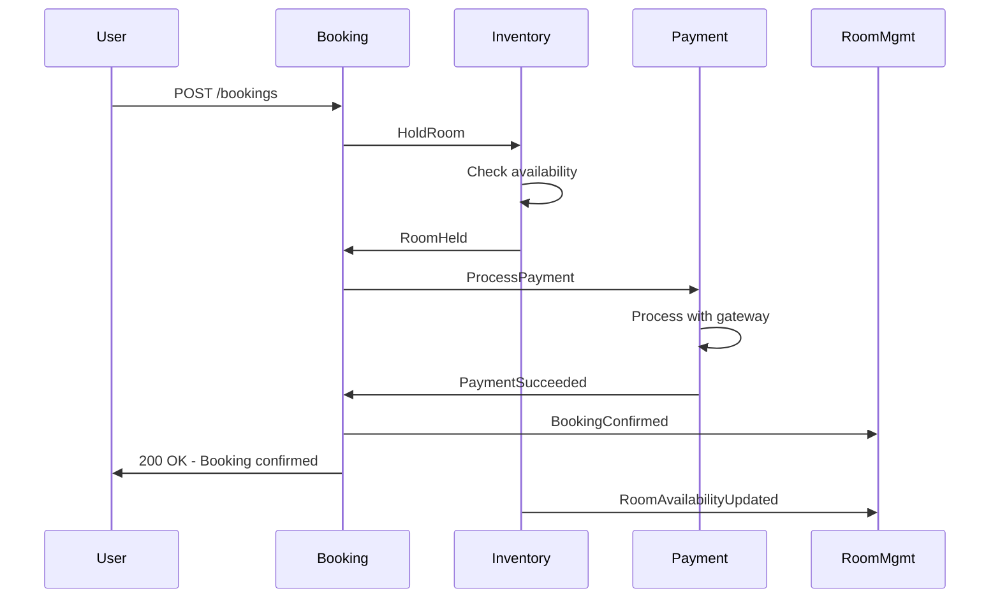
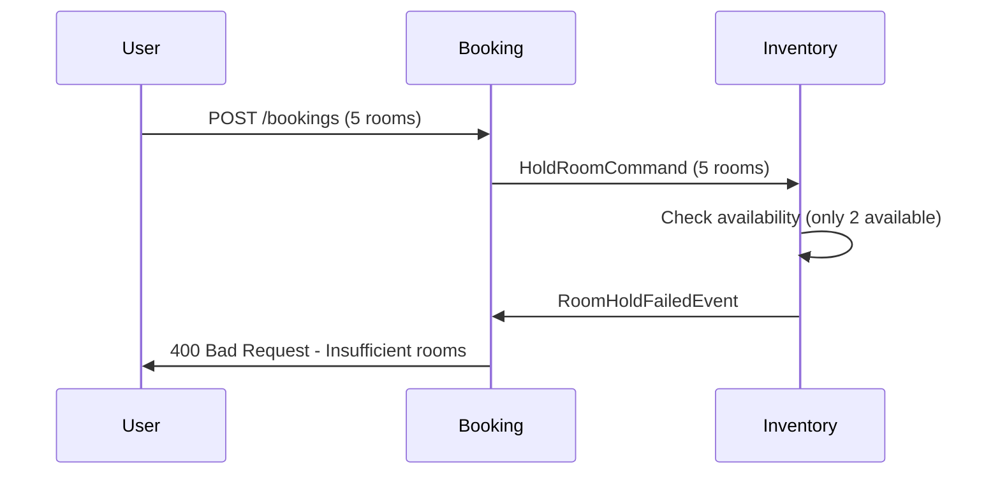
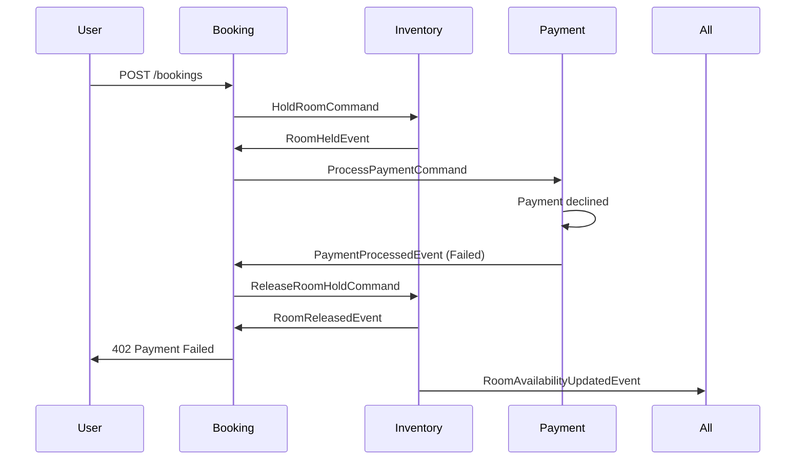
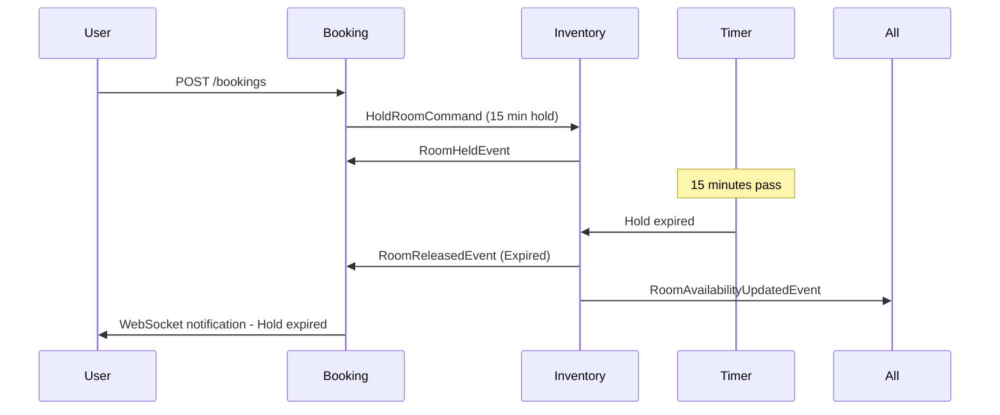
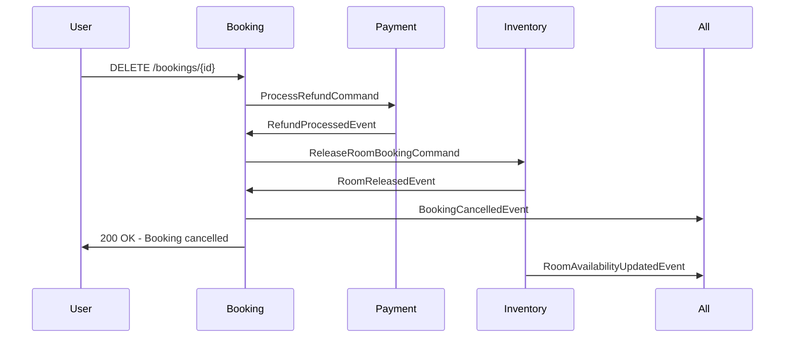

# 📋 Booking Flow Scenarios

## 🎯 Complete Booking Flows

### ✅ **Happy Path - Successful Booking**



**Message Flow:**
1. `HoldRoom` (Booking → Inventory)
2. `RoomHeld` (Inventory → Booking)  
3. `ProcessPayment` (Booking → Payment)
4. `PaymentSucceeded` (Payment → Booking)
5. `BookingConfirmed` (Booking → All Services) *[Future contract]*
6. `RoomAvailabilityUpdated` (Inventory → All Services) *[Future contract]*

---

### ❌ **Insufficient Inventory Scenario**



**Message Flow:**
1. `HoldRoom` (Booking → Inventory)
2. `RoomHoldFailed` (Inventory → Booking)

**Error Response:**
```json
{
  "error": "INSUFFICIENT_INVENTORY",
  "message": "Only 2 rooms available for requested dates",
  "requestedRooms": 5,
  "availableRooms": 2
}
```

---

### 💳 **Payment Failure Scenario**



**Message Flow:**
1. `HoldRoom` (Booking → Inventory)
2. `RoomHeld` (Inventory → Booking)
3. `ProcessPayment` (Booking → Payment)
4. `PaymentFailed` (Payment → Booking) - **Failed**
5. `ReleaseRoom` (Booking → Inventory)
6. `RoomReleased` (Inventory → Booking)
7. `RoomAvailabilityUpdated` (Inventory → All Services) *[Future contract]*

---

### ⏰ **Hold Expiry Scenario**



**Auto-Release Logic:**
- Background service checks expired holds every minute
- Automatically releases expired holds
- Publishes `RoomReleasedEvent` with reason "Expired"

---

### 🔄 **Booking Cancellation Flow**



---

## 🔧 Consumer Implementation Examples

### Booking Service Consumers (✅ **Implemented**)

```csharp
// Already implemented in BookingSaga
public class BookingSaga : SagaStateMachineInstance
{
    // Handles RoomHeldEvent, PaymentProcessedEvent, etc.
}
```

### RoomManagement Service Consumers (⏳ **To Implement**)

```csharp
public class BookingConfirmedConsumer : IConsumer<BookingConfirmedEvent>
{
    public async Task Consume(ConsumeContext<BookingConfirmedEvent> context)
    {
        // Update hotel booking statistics
        // Track revenue and occupancy rates
    }
}

public class RoomAvailabilityUpdatedConsumer : IConsumer<RoomAvailabilityUpdatedEvent>
{
    public async Task Consume(ConsumeContext<RoomAvailabilityUpdatedEvent> context)
    {
        // Implement dynamic pricing based on availability
        var occupancyRate = CalculateOccupancyRate(context.Message);
        if (occupancyRate > 0.8m)
        {
            await ApplyHighDemandPricing(context.Message);
        }
    }
}
```

### Inventory Service Consumers (⏳ **To Implement**)

```csharp
public class RoomTypeCreatedConsumer : IConsumer<RoomTypeCreatedEvent>
{
    public async Task Consume(ConsumeContext<RoomTypeCreatedEvent> context)
    {
        // Initialize room inventory for next 365 days
        await _inventoryService.InitializeRoomTypeAsync(context.Message);
    }
}

public class HoldRoomConsumer : IConsumer<HoldRoomCommand>
{
    public async Task Consume(ConsumeContext<HoldRoomCommand> context)
    {
        try
        {
            var hold = await _inventoryService.HoldRoomsAsync(context.Message);
            await context.Publish(new RoomHeldEvent { /* ... */ });
        }
        catch (InsufficientInventoryException)
        {
            await context.Publish(new RoomHoldFailedEvent { /* ... */ });
        }
    }
}
```

### Payment Service Consumers (⏳ **To Implement**)

```csharp
public class ProcessPaymentConsumer : IConsumer<ProcessPaymentCommand>
{
    public async Task Consume(ConsumeContext<ProcessPaymentCommand> context)
    {
        try
        {
            var result = await _paymentGateway.ChargeAsync(context.Message);
            await context.Publish(new PaymentProcessedEvent 
            { 
                Success = true,
                TransactionId = result.TransactionId 
            });
        }
        catch (PaymentDeclinedException ex)
        {
            await context.Publish(new PaymentProcessedEvent 
            { 
                Success = false,
                FailureReason = ex.DeclineReason 
            });
        }
    }
}
```

---

## 📊 Error Handling & Retry Patterns

### MassTransit Retry Configuration

```csharp
cfg.ReceiveEndpoint("inventory-commands", e =>
{
    e.UseMessageRetry(r => 
    {
        r.Interval(3, TimeSpan.FromSeconds(5));
        r.Ignore<InsufficientInventoryException>();
    });
    
    e.ConfigureConsumer<HoldRoomConsumer>(context);
});
```

### Dead Letter Queue Handling

```csharp
cfg.ReceiveEndpoint("payment-commands", e =>
{
    e.UseMessageRetry(r => r.Interval(3, TimeSpan.FromSeconds(10)));
    
    // After retries fail, send to error queue
    e.ConfigureDeadLetterQueue("payment-errors");
    
    e.ConfigureConsumer<ProcessPaymentConsumer>(context);
});
```

---

## 🎯 Testing Scenarios

### Integration Test Examples

```csharp
[Test]
public async Task BookingFlow_HappyPath_ShouldCompleteSuccessfully()
{
    // Arrange
    var bookingRequest = new CreateBookingRequest { /* ... */ };
    
    // Act
    var response = await _client.PostAsync("/bookings", bookingRequest);
    
    // Assert
    response.StatusCode.Should().Be(HttpStatusCode.OK);
    
    // Verify messages were published
    await _testHarness.Published.Any<HoldRoomCommand>();
    await _testHarness.Published.Any<ProcessPaymentCommand>();
    await _testHarness.Published.Any<BookingConfirmedEvent>();
}

[Test]  
public async Task BookingFlow_InsufficientInventory_ShouldFailGracefully()
{
    // Arrange - setup inventory with only 1 room
    var bookingRequest = new CreateBookingRequest { RoomCount = 5 };
    
    // Act
    var response = await _client.PostAsync("/bookings", bookingRequest);
    
    // Assert
    response.StatusCode.Should().Be(HttpStatusCode.BadRequest);
    await _testHarness.Published.Any<RoomHoldFailedEvent>();
}
```

---

## 📋 Implementation Priority

1. **✅ Completed**: Booking Service with saga pattern
2. **🔄 Next**: Add RoomManagement consumers for dynamic pricing
3. **🏗️ Then**: Implement Inventory Service with room tracking
4. **💳 Finally**: Implement Payment Service with gateway integration

Each service can be implemented and tested independently using the message contracts defined above. 