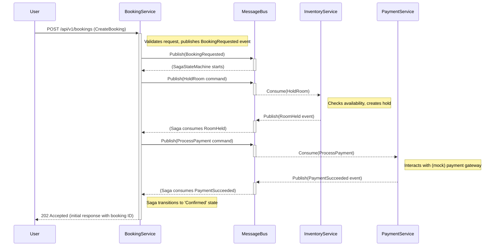
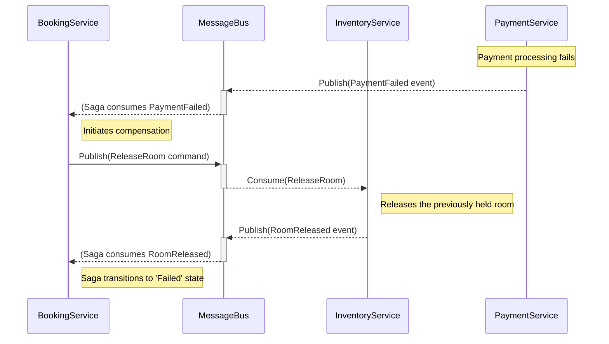

# Design Plan: Evolving to a Full Microservices-Based Booking System

## 1. Executive Summary & Goals
This document outlines the architectural design and phased implementation plan to evolve the Hotel Booking System from a single-service simulation into a distributed system with multiple, specialized microservices. The current `BookingService` correctly uses the Saga pattern for orchestration but simulates the work of other services. This plan details the creation of dedicated services for Inventory and Payments to replace that simulation.

-   **Primary Objective:** To design and provide a roadmap for building a complete, multi-microservice hotel booking system that correctly implements the Saga pattern for handling distributed transactions.
-   **Key Goals:**
    1.  **Decompose Responsibilities:** Create new, dedicated microservices (`InventoryService`, `PaymentService`, `RoomManagementService`) to handle their specific business domains, replacing the simulated logic in `BookingService`.
    2.  **Achieve True Distribution:** Implement robust, asynchronous communication between services using the existing message bus (RabbitMQ with MassTransit).
    3.  **Provide a Clear Path Forward:** Deliver a phased, actionable plan that guides the development from the current state to a fully functional, distributed system.

## 2. Current Situation Analysis
The existing system provides an excellent foundation. It consists of a `BookingService` built with Clean Architecture principles and a .NET Aspire `AppHost` for orchestration.

-   **Strengths:**
    -   The `BookingService` correctly acts as a Saga orchestrator using a `BookingSagaStateMachine` with MassTransit.
    -   The project structure is sound, leveraging Clean Architecture (`Domain`, `Application`, `Infrastructure`, `Api`).
    -   .NET Aspire is already configured, simplifying local development and service discovery.
    -   Message contracts (Commands/Events) are well-defined in the `BookingService.Domain` project.

-   **Key Limitations / Pain Points:**
    -   **Simulated Logic:** The core limitation is that the consumers for saga activities (`HoldRoomConsumer`, `ProcessPaymentConsumer`, `ReleaseRoomConsumer`) reside within the `BookingService.Infrastructure`. This means the service is essentially talking to itself, defeating the purpose of a distributed microservice architecture.
    -   **Single Point of Failure:** All business logic (booking, inventory, payment) is currently coupled within one service, violating the Single Responsibility Principle and creating a monolith in practice.
    -   **Incomplete System:** The `AppHost` and solution file reference a `RoomManagementService` and `InventoryService`, but these are not yet implemented, leaving the system incomplete. A `PaymentService` is also logically required but not yet defined.

## 3. Proposed Solution / Refactoring Strategy
The strategy is to systematically build out the missing microservices, migrating the simulated logic from `BookingService` into its new, correct home. Each new service will be a first-class citizen in the .NET Aspire application, with its own data store and responsibilities.

### 3.1. High-Level Design / Architectural Overview
The target architecture will consist of four primary microservices communicating asynchronously via a message bus. The `BookingService` will act purely as an orchestrator for the booking saga.

**Compensation Flow (e.g., Payment Failure):**

### 3.2. Key Components / Modules

1.  **`BookingService` (Refactored):**
    -   **Responsibility:** Remains the Saga orchestrator. Manages the `BookingState` and exposes the public API for creating and checking bookings.
    -   **Key Changes:** The `HoldRoomConsumer`, `ProcessPaymentConsumer`, and `ReleaseRoomConsumer` will be **deleted** from this service. Its role is simplified to sending commands and reacting to events.

2.  **`InventoryService` (New):**
    -   **Responsibility:** Manages room availability, holds, and final reservations for all hotels. It is the source of truth for "is this room available on these dates?".
    -   **Interactions:**
        -   Consumes `HoldRoom` and `ReleaseRoom` commands from the message bus.
        -   Publishes `RoomHeld`, `RoomHoldFailed`, and `RoomReleased` events.
        -   May perform synchronous HTTP calls to `RoomManagementService` to get room details if needed.

3.  **`PaymentService` (New):**
    -   **Responsibility:** Handles all payment-related logic.
    -   **Interactions:**
        -   Consumes `ProcessPayment` command.
        -   Publishes `PaymentSucceeded` and `PaymentFailed` events.
        -   (Internally) It would interact with a third-party payment gateway (e.g., Stripe, Adyen), which can be mocked for this project.

4.  **`RoomManagementService` (New):**
    -   **Responsibility:** Manages the master data for hotels and room types (e.g., hotel name, address, room descriptions, capacity, base price). This service is not directly part of the saga flow but provides essential data to other services.
    -   **Interactions:**
        -   Exposes a standard CRUD API (e.g., `GET /api/hotels`, `POST /api/hotels/{id}/roomtypes`).
        -   Will be called by other services (like a future UI or the `BookingService`) to get hotel/room information.

### 3.3. Detailed Action Plan / Phases

#### Phase 1: Establish the Inventory Service
-   **Objective(s):** Create a dedicated service to manage room inventory and holds, and migrate the relevant logic out of `BookingService`.
-   **Priority:** High

-   **Task 1.1:** Create `InventoryService` Solution Structure
    -   **Rationale/Goal:** Establish a clean architecture foundation for the new service.
    -   **Estimated Effort:** S
    -   **Deliverable/Criteria for Completion:** A new solution folder `src/InventoryService` is created with four projects: `Api`, `Application`, `Domain`, and `Infrastructure`, mirroring the `BookingService` structure.

-   **Task 1.2:** Implement `InventoryService` Consumers
    -   **Rationale/Goal:** Move the real business logic for holding and releasing rooms into the correct service.
    -   **Estimated Effort:** M
    -   **Deliverable/Criteria for Completion:** `HoldRoomConsumer` and `ReleaseRoomConsumer` are implemented in `InventoryService.Infrastructure`. They should contain logic to interact with the `InventoryService`'s database to check availability and manage holds.

-   **Task 1.3:** Integrate `InventoryService` into Aspire `AppHost`
    -   **Rationale/Goal:** Make the new service a runnable part of the distributed application.
    -   **Estimated Effort:** S
    -   **Deliverable/Criteria for Completion:** `AppHost.cs` is updated to properly build and run the `InventoryService`, connecting it to the shared RabbitMQ and its own PostgreSQL database (`inventorydb`).

-   **Task 1.4:** Refactor `BookingService`
    -   **Rationale/Goal:** Decouple `BookingService` from inventory logic.
    -   **Estimated Effort:** S
    -   **Deliverable/Criteria for Completion:** The `HoldRoomConsumer` and `ReleaseRoomConsumer` classes are deleted from the `BookingService.Infrastructure` project. The system runs successfully, with `BookingService` sending commands and `InventoryService` consuming them.

#### Phase 2: Establish the Payment Service
-   **Objective(s):** Create a dedicated service to handle payment processing.
-   **Priority:** High

-   **Task 2.1:** Create `PaymentService` Solution Structure
    -   **Rationale/Goal:** Establish a clean architecture foundation for the new service.
    -   **Estimated Effort:** S
    -   **Deliverable/Criteria for Completion:** A new solution folder `src/PaymentService` is created with the standard four projects.

-   **Task 2.2:** Implement `PaymentService` Consumer
    -   **Rationale/Goal:** Isolate payment logic into its own service.
    -   **Estimated Effort:** M
    -   **Deliverable/Criteria for Completion:** `ProcessPaymentConsumer` is implemented in `PaymentService.Infrastructure`. It should contain mock logic to simulate success/failure of a payment transaction.

-   **Task 2.3:** Integrate `PaymentService` into Aspire `AppHost`
    -   **Rationale/Goal:** Make the new service a runnable part of the distributed application.
    -   **Estimated Effort:** S
    -   **Deliverable/Criteria for Completion:** `AppHost.cs` is updated to run the `PaymentService`, connecting it to RabbitMQ and its own database (`paymentdb`).

-   **Task 2.4:** Refactor `BookingService`
    -   **Rationale/Goal:** Decouple `BookingService` from payment logic.
    -   **Estimated Effort:** S
    -   **Deliverable/Criteria for Completion:** The `ProcessPaymentConsumer` class is deleted from the `BookingService.Infrastructure` project. The full saga flow now works across all three services.

#### Phase 3: Establish the Room Management Service
-   **Objective(s):** Create a service to manage master data for hotels and rooms.
-   **Priority:** Medium

-   **Task 3.1:** Create `RoomManagementService` Solution Structure & API
    -   **Rationale/Goal:** Provide a central place for managing hotel and room master data.
    -   **Estimated Effort:** M
    -   **Deliverable/Criteria for Completion:** `RoomManagementService` is created and exposes basic CRUD REST endpoints for creating and retrieving hotels and room types.

-   **Task 3.2:** Implement Data Seeding
    -   **Rationale/Goal:** Populate the system with initial data to make it testable.
    -   **Estimated Effort:** S
    -   **Deliverable/Criteria for Completion:** A data seeding mechanism (e.g., run on startup in `Development` environment) is added to `RoomManagementService` to create sample hotels/rooms and to `InventoryService` to create initial availability records for those rooms.

#### Phase 4: Finalize and Verify
-   **Objective(s):** Ensure the entire system is robust, tested, and the CI/CD pipeline is up-to-date.
-   **Priority:** High

-   **Task 4.1:** Update CI/CD Pipeline
    -   **Rationale/Goal:** Ensure new services are automatically built, tested, and scanned.
    -   **Estimated Effort:** M
    -   **Deliverable/Criteria for Completion:** The `.github/workflows/ci.yml` file is updated to include build, test, and Docker build steps for `InventoryService`, `PaymentService`, and `RoomManagementService`.

-   **Task 4.2:** Write End-to-End Integration Tests
    -   **Rationale/Goal:** Verify the complete saga flow across all microservices.
    -   **Estimated Effort:** L
    -   **Deliverable/Criteria for Completion:** A new integration test project is created that uses `Testcontainers` or a similar library to spin up the required infrastructure (Postgres, RabbitMQ) and services. Tests will call the `BookingService` API and assert that the correct final state (`Confirmed` or `Failed`) is reached and that compensating actions occur correctly.

### 3.4. Data Model Changes

-   **`InventoryService` (`inventorydb`):**
    -   `RoomAvailability` table: `(RoomTypeId, Date, Status, BookingId)`. Tracks the state of each room for each day.
    -   `RoomHolds` table: `(HoldId, BookingId, RoomTypeId, StartDate, EndDate, ExpiresAt)`. Tracks active holds to ensure they can be expired or released.

-   **`PaymentService` (`paymentdb`):**
    -   `PaymentTransactions` table: `(TransactionId, BookingId, Amount, Currency, Status, GatewayReference, CreatedAt, UpdatedAt)`.

-   **`RoomManagementService` (`roommanagementdb`):**
    -   `Hotels` table: `(HotelId, Name, Address, ...)`
    -   `RoomTypes` table: `(RoomTypeId, HotelId, Name, Description, Capacity, ...)`

### 3.5. API Design / Interface Changes
-   The primary API in `BookingService` (`POST /bookings`, `GET /bookings/{id}/status`) remains unchanged to its consumers.
-   **`RoomManagementService`** will expose new RESTful APIs:
    -   `GET /api/v1/hotels`
    -   `POST /api/v1/hotels`
    -   `GET /api/v1/hotels/{hotelId}/roomtypes`
    -   `POST /api/v1/hotels/{hotelId}/roomtypes`

## 4. Key Considerations & Risk Mitigation

### 4.1. Technical Risks & Challenges
-   **Challenge:** Ensuring Idempotent Consumers. A message might be delivered more than once.
    -   **Mitigation:** Consumers in `InventoryService` and `PaymentService` must be designed to be idempotent. For example, when consuming `HoldRoom`, the service should first check if a hold for that `BookingId` already exists. MassTransit's transactional outbox or `IdempotentSagaRepository` can also be leveraged to provide guarantees.
-   **Challenge:** Increased complexity of local development and debugging.
    -   **Mitigation:** This is largely solved by .NET Aspire, which is already in use. The Aspire dashboard will be crucial for viewing logs and traces across all services.
-   **Challenge:** Distributed Data Consistency.
    -   **Mitigation:** The Saga pattern is the chosen solution for this. This plan reinforces its correct implementation by separating concerns into their own transactional boundaries.

### 4.2. Dependencies
-   **Task Dependencies:** The phases are designed to be sequential. `InventoryService` and `PaymentService` must be built before the `BookingService` can be fully refactored.
-   **Infrastructure Dependencies:** All services depend on a running PostgreSQL instance and a RabbitMQ broker, which are managed by the `AppHost`.

### 4.3. Non-Functional Requirements (NFRs) Addressed
-   **Scalability:** Each microservice can be scaled independently. If payment processing is slow, only the `PaymentService` needs more resources.
-   **Resilience:** The asynchronous, message-based architecture makes the system resilient to temporary service outages. If the `PaymentService` is down, `HoldRoom` commands can still be processed, and payment messages will be queued in RabbitMQ until the service recovers.
-   **Maintainability:** By adhering to Clean Architecture and the Single Responsibility Principle, each service is smaller, more focused, and easier to understand and maintain.
-   **Testability:** Each service can be tested in isolation. End-to-end integration tests will verify the collaboration between services.

## 5. Success Metrics / Validation Criteria
The successful implementation of this plan will be measured by:
1.  **Functional Correctness:** A booking request submitted to `BookingService` successfully triggers the full saga, resulting in a `Confirmed` state and corresponding records in the `InventoryService` and `PaymentService` databases.
2.  **Compensation Verification:** A simulated payment failure correctly triggers the `ReleaseRoom` command, which is processed by `InventoryService`, and the saga concludes in a `Failed` state.
3.  **Code Removal:** The simulated consumer classes (`HoldRoomConsumer`, `ProcessPaymentConsumer`, `ReleaseRoomConsumer`) are no longer present in the `BookingService` project.
4.  **CI/CD Pipeline:** The CI/CD workflow in GitHub Actions successfully builds and runs tests for all microservices.

## 6. Assumptions Made
-   The current technology stack (.NET, Aspire, MassTransit, PostgreSQL) is preferred and will be used for the new services.
-   Asynchronous communication via a message bus is the primary pattern for inter-service collaboration within the saga.
-   For this learning project, mocking external dependencies like payment gateways within the respective services is an acceptable approach.
-   The separation of concerns between `RoomManagementService` (master data) and `InventoryService` (transactional availability) is the desired architecture.

## 7. Open Questions / Areas for Further Investigation
-   **Cross-Service Data Queries:** How should a service get data owned by another? For example, if the UI needs to display the Hotel Name for a booking, should the UI call both `BookingService` and `RoomManagementService`, or should `BookingService` replicate the Hotel Name in its `BookingState`?
    -   *Recommendation:* For now, favor direct API calls from the client/UI to the owning service. For more advanced scenarios, consider materializing views or replicating data via events.
-   **Inventory Locking Strategy:** What is the desired inventory management strategy? The current plan implies a temporary "hold". Should this hold expire automatically?
    -   *Recommendation:* Yes, the `InventoryService` should have a background process or use a delayed message (`Schedule` in MassTransit) to automatically release holds that are not confirmed within a certain timeframe (e.g., 10 minutes).
-   **Configuration Management:** How will service-specific configurations (e.g., payment gateway API keys) be managed securely?
    -   *Recommendation:* Use .NET's User Secrets for local development and a secure store like Azure Key Vault or HashiCorp Vault for production environments.