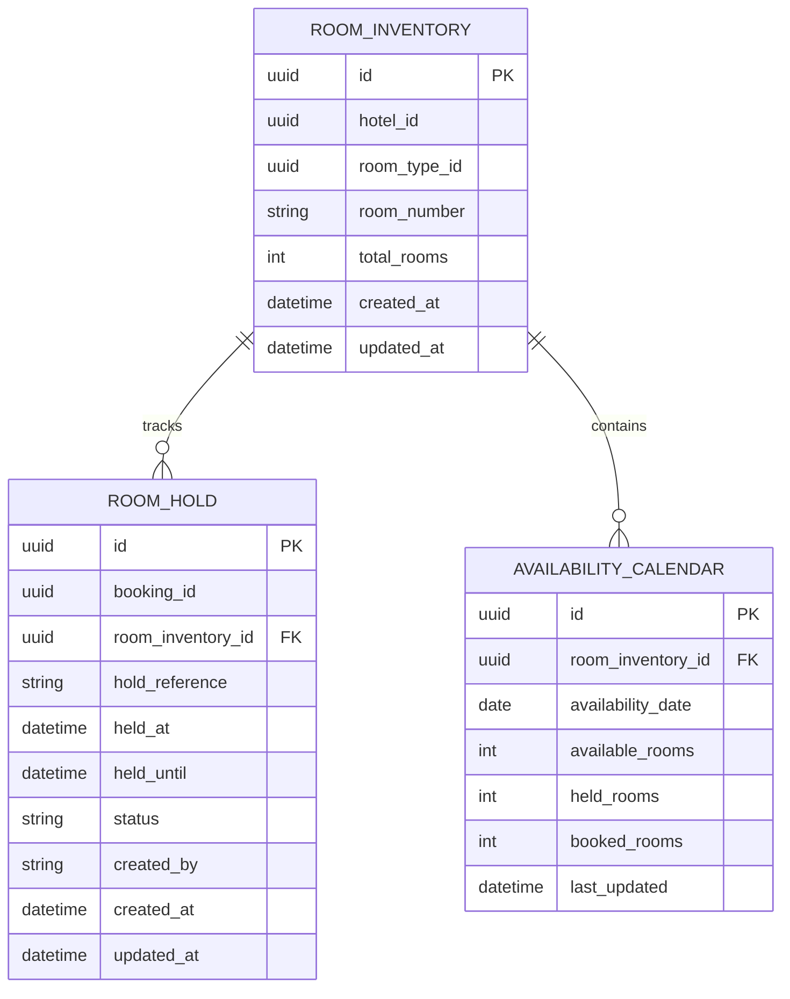
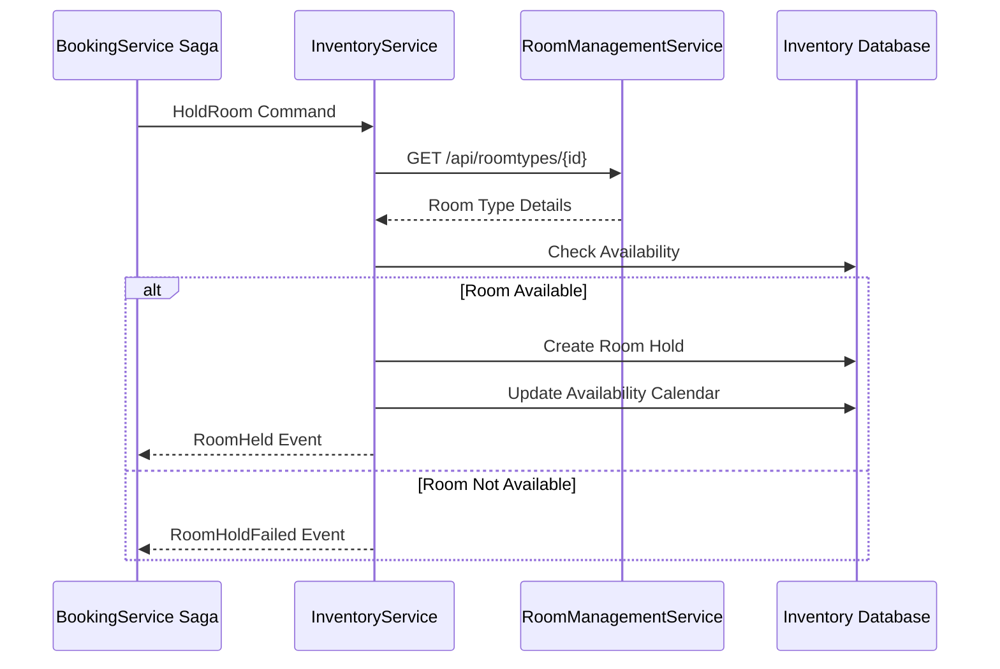

# Technical Design Document: InventoryService

## 1. Overview

The InventoryService is a dedicated microservice responsible for managing real-time room availability, reservation holds, and booking inventory operations within the Hotel Booking System. This service acts as the authoritative source for room availability queries and reservation state management, serving primarily the BookingService saga orchestration while integrating with the existing RoomManagementService for master data.

## 2. Requirements

### 2.1 Functional Requirements

* **INV-001**: As a BookingService saga, I want to check room availability for specific dates so that I can determine if a booking request can be fulfilled.
* **INV-002**: As a BookingService saga, I want to hold a room for a limited time period so that I can complete the booking process without losing the room to another guest.
* **INV-003**: As a BookingService saga, I want to release a room hold when payment fails so that the room becomes available for other bookings (compensation pattern).
* **INV-004**: As a BookingService saga, I want room holds to automatically expire after a timeout so that rooms are not indefinitely blocked.
* **INV-005**: As an operations team, I want to view real-time room inventory status so that I can monitor availability and holds.
* **INV-006**: As a system, I want to prevent double-booking scenarios so that room inventory remains consistent.

### 2.2 Non-Functional Requirements

* **Performance**: Room availability queries must complete within 200ms under normal load.
* **Performance**: Room hold operations must complete within 500ms under normal load.
* **Scalability**: The system should handle 1000 concurrent availability checks and 200 concurrent hold operations.
* **Reliability**: Room hold timeouts must be handled reliably with 99.9% accuracy.
* **Consistency**: Strong consistency required for hold operations to prevent double-booking.
* **Security**: All API endpoints must be secured and authenticated.

## 3. Technical Design

### 3.1. Microservice Assignment

**Primary Owner**: InventoryService
- Real-time availability checking
- Room hold management and timeouts
- Reservation state tracking
- Inventory consistency enforcement

### 3.2. Data Model Changes

**New Database Schema for InventoryService**:



### 3.3. API Changes

**New REST Endpoints**:

```http
# Check room availability
GET /api/v1/inventory/availability
Query Parameters:
- hotelId: guid (required)
- roomTypeId: guid (required) 
- checkInDate: date (required)
- checkOutDate: date (required)
- numberOfGuests: int (required)

# Hold a room
POST /api/v1/inventory/holds
{
  "bookingId": "uuid",
  "hotelId": "uuid",
  "roomTypeId": "uuid", 
  "checkInDate": "2024-01-15",
  "checkOutDate": "2024-01-17",
  "numberOfGuests": 2,
  "holdDurationMinutes": 10
}

# Release a room hold
DELETE /api/v1/inventory/holds/{holdReference}
{
  "bookingId": "uuid",
  "reason": "Payment failed - saga compensation"
}
```

### 3.4. Messaging & Events

**Message Contracts for BookingService Integration**:

```csharp
// Commands received from BookingService
public interface HoldRoom
{
    Guid BookingId { get; }
    Guid HotelId { get; }
    Guid RoomTypeId { get; }
    DateTime CheckInDate { get; }
    DateTime CheckOutDate { get; }
    int NumberOfGuests { get; }
    TimeSpan HoldDuration { get; }
}

// Events published to BookingService
public interface RoomHeld
{
    Guid BookingId { get; }
    string RoomHoldReference { get; }
    string RoomNumber { get; }
    DateTime HeldUntil { get; }
}
```

### 3.5. Logic Flow

**Room Hold Saga Flow**:



### 3.6. Dependencies

**New NuGet Packages**:
```xml
<PackageReference Include="Microsoft.EntityFrameworkCore" Version="8.0.0" />
<PackageReference Include="Npgsql.EntityFrameworkCore.PostgreSQL" Version="8.0.0" />
<PackageReference Include="MassTransit" Version="8.1.0" />
<PackageReference Include="MassTransit.RabbitMQ" Version="8.1.0" />
<PackageReference Include="MediatR" Version="12.2.0" />
```

## 4. Testing Plan

### Unit Tests
* Domain entity behavior and business rules
* Command/query handlers with mocked dependencies
* Availability calculation logic

### Integration Tests
* Database operations with TestContainers
* MassTransit message publishing/consuming
* HTTP client integration with RoomManagementService

## 5. Deployment Considerations

**.NET Aspire AppHost Configuration**:
```csharp
var inventoryDb = builder.AddPostgres("postgres")
    .WithEnvironment("POSTGRES_DB", "inventorydb")
    .AddDatabase("inventorydb");

var inventoryService = builder.AddProject<Projects.InventoryService_Api>("inventoryservice")
    .WithReference(inventoryDb)
    .WithReference(rabbitmq);
```

## 6. Open Questions

* Should we implement optimistic or pessimistic locking for room holds?
* How should we handle timezone considerations for availability dates?
* What is the maximum number of concurrent holds per room type?

## 7. Alternatives Considered

### Alternative 1: Extend RoomManagementService
**Rejected**: Violates single responsibility principle

### Alternative 2: Event-only Communication
**Rejected**: BookingService needs synchronous availability checking

---

**Document Version**: 1.0  
**Created**: 2024-01-15  
**Author**: System Architect  
**Review Status**: Draft - Pending Review 